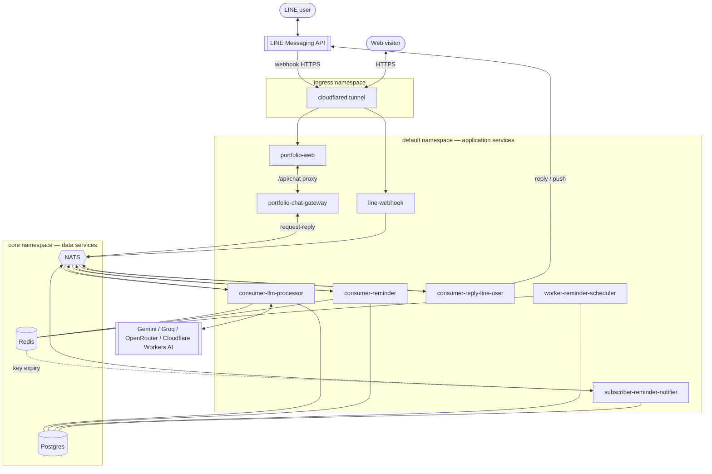

# System overview

The homelab runs an **event-driven AI chat platform**. At its center is a
channel-agnostic pipeline — **consumer-llm-processor** — that classifies a
message, routes it through a fallback chain of LLM providers, keeps conversation
memory, and returns an answer. Around that core sit **channels**: a **LINE
Official Account** (chat, image generation, reminders) and an **"Ask AI about
me" widget** on the portfolio website. Each channel only has to get a message
in and a reply out; the thinking is shared.

The system is **event-driven** — inbound messages become NATS messages, and a
small fleet of single-purpose Go services react to them. No service ever blocks
on another; they communicate only through NATS subjects and shared
Postgres/Redis. The one exception is the web channel, where a visitor is waiting
on an open HTTP request, so it uses **NATS request-reply** instead of
fire-and-forget (see the [portfolio chatbot](/services/portfolio-chatbot)).

## Container diagram

## The services at a glance

| Service | Role | Talks to |
|---------|------|----------|
| **portfolio-web** | The Next.js portfolio site. Hosts the AI chat widget and a same-origin `/api/chat` route handler that proxies to the gateway (keeping the gateway private). | portfolio-chat-gateway |
| **portfolio-chat-gateway** | Web-channel ingress **and** egress. Validates and rate-limits visitor messages, then does one NATS **request-reply** round trip to the AI pipeline and returns the answer on the still-open HTTP request. ClusterIP-only. | NATS (request-reply) |
| **line-webhook** | The LINE ingress. Verifies LINE signatures, turns webhook events into NATS messages, downloads image attachments. Never replies to LINE itself. | NATS (pub), Redis |
| **consumer-llm-processor** | The AI brain, shared by every channel. Classifies each message, routes it to a provider chain (Gemini/Groq/OpenRouter), keeps conversation memory, generates images, and detects reminder intent. Subscribes to the LINE `ai_request` (fire-and-forget) **and** the web `portfolio.chat.ai_request` (request-reply) subjects. | NATS (sub+pub), Postgres, Redis, external LLMs |
| **consumer-reminder** | Owns the reminder conversation flow and the `line_users` + `reminders` tables. Never calls an LLM — it receives already-extracted reminder details. | NATS (sub+pub), Postgres, Redis |
| **consumer-reply-line-user** | The only egress. Delivers replies to LINE (reply token first, push fallback), supports text / images / flex / quick-replies. | NATS (sub+pub), LINE API |
| **worker-reminder-scheduler** | A cron loop that arms due reminders as expiring Redis keys and repairs anything that drifts. | Postgres, Redis |
| **subscriber-reminder-notifier** | Turns Redis key-expiry events into flex-message reminders. | NATS (pub+sub), Postgres, Redis |

## Request lifecycle (the short version)

**LINE channel — fire-and-forget:**

1. A LINE user sends a message. LINE POSTs a webhook over HTTPS through the
   **cloudflared tunnel** to **line-webhook**.
2. line-webhook verifies the signature and publishes a NATS event
   (`line.chat.ai_request`, or a postback/profile event), then returns `200`
   immediately.
3. **consumer-llm-processor** (for chat) or **consumer-reminder** (for reminder
   flow) reacts, does its work, and publishes a `line.chat.reply`.
4. **consumer-reply-line-user** consumes the reply and sends it back to the user
   via the LINE API.

**Web channel — request-reply:**

1. A visitor types in the chat widget on **portfolio-web**; the browser POSTs
   same-origin to `/api/chat`, which proxies to **portfolio-chat-gateway**
   (through the tunnel, gateway stays private).
2. The gateway validates + rate-limits, then makes one NATS **request** on
   `portfolio.chat.ai_request` and holds the HTTP connection open.
3. **consumer-llm-processor** answers that subject with the same
   classify → route → memory pipeline (using a professional portfolio persona)
   and **replies on the NATS inbox** — no downstream delivery service.
4. The gateway returns the answer as the HTTP response; the widget renders it.

See the [portfolio chatbot](/services/portfolio-chatbot) page and its
[sequence](/diagrams/sequence-portfolio-chat) for the full web flow, and the
[AI chat sequence](/diagrams/sequence-ai-chat) for LINE.

Reminders add a time axis: consumer-reminder saves a row, then later
**worker-reminder-scheduler** and **subscriber-reminder-notifier** fire it —
covered in the [reminder system](/services/reminder-system) page and the
[fire sequence](/diagrams/sequence-reminder#firing-a-reminder).

## Design principles

- **One responsibility per service.** The webhook only ingests; the reply
  consumer only delivers; the LLM processor only thinks. This keeps each service
  small enough to reason about and lets them fail independently.
- **NATS is the only inter-service coupling.** Services share no in-process
  state; they agree on [subject names](/data-services/nats) and event schemas.
- **Postgres is the source of truth; Redis is a rebuildable cache.** Redis has
  no persistent volume — every key can be reconstructed from Postgres or is
  short-lived by design.
- **Everything is sized for a 3.7 GiB Pi.** Tight resource limits, in-memory
  data services where durability isn't required, and a wave-based rollout so a
  cold start doesn't overwhelm the single node.
