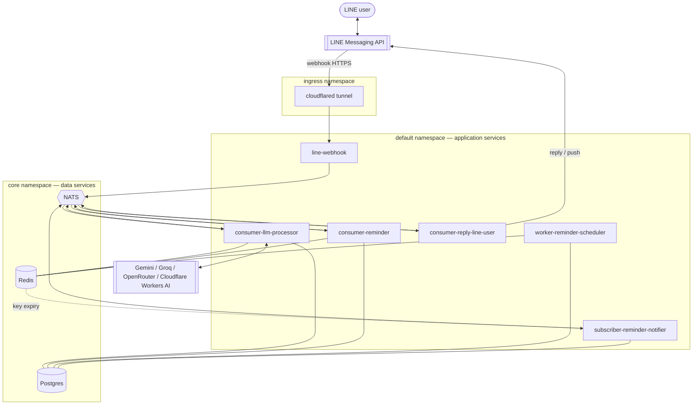

# System overview

Everything in the homelab exists to serve one product: a **LINE Official
Account** that can chat with an AI assistant, generate images, and set
reminders. The system is **event-driven** — LINE webhooks become NATS messages,
and a small fleet of single-purpose Go services react to them. No service ever
blocks on another; they communicate only through NATS subjects and shared
Postgres/Redis.

## Container diagram

## The services at a glance

| Service | Role | Talks to |
|---------|------|----------|
| **line-webhook** | The only ingress. Verifies LINE signatures, turns webhook events into NATS messages, downloads image attachments. Never replies to LINE itself. | NATS (pub), Redis |
| **consumer-llm-processor** | The AI brain. Classifies each message, routes it to a provider chain (Gemini/Groq/OpenRouter), keeps conversation memory, generates images, and detects reminder intent. | NATS (sub+pub), Postgres, Redis, external LLMs |
| **consumer-reminder** | Owns the reminder conversation flow and the `line_users` + `reminders` tables. Never calls an LLM — it receives already-extracted reminder details. | NATS (sub+pub), Postgres, Redis |
| **consumer-reply-line-user** | The only egress. Delivers replies to LINE (reply token first, push fallback), supports text / images / flex / quick-replies. | NATS (sub+pub), LINE API |
| **worker-reminder-scheduler** | A cron loop that arms due reminders as expiring Redis keys and repairs anything that drifts. | Postgres, Redis |
| **subscriber-reminder-notifier** | Turns Redis key-expiry events into flex-message reminders. | NATS (pub+sub), Postgres, Redis |

## Request lifecycle (the short version)

1. A LINE user sends a message. LINE POSTs a webhook over HTTPS through the
   **cloudflared tunnel** to **line-webhook**.
2. line-webhook verifies the signature and publishes a NATS event
   (`line.chat.ai_request`, or a postback/profile event).
3. **consumer-llm-processor** (for chat) or **consumer-reminder** (for reminder
   flow) reacts, does its work, and publishes a `line.chat.reply`.
4. **consumer-reply-line-user** consumes the reply and sends it back to the user
   via the LINE API.

Reminders add a time axis: consumer-reminder saves a row, then later
**worker-reminder-scheduler** and **subscriber-reminder-notifier** fire it —
covered in the [reminder system](/services/reminder-system) page and the
[fire sequence](/diagrams/sequence-reminder-fire).

## Design principles

- **One responsibility per service.** The webhook only ingests; the reply
  consumer only delivers; the LLM processor only thinks. This keeps each service
  small enough to reason about and lets them fail independently.
- **NATS is the only inter-service coupling.** Services share no in-process
  state; they agree on [subject names](/data-services/nats) and event schemas.
- **Postgres is the source of truth; Redis is a rebuildable cache.** Redis has
  no persistent volume — every key can be reconstructed from Postgres or is
  short-lived by design.
- **Everything is sized for a 3.7 GiB Pi.** Tight resource limits, in-memory
  data services where durability isn't required, and a wave-based rollout so a
  cold start doesn't overwhelm the single node.
