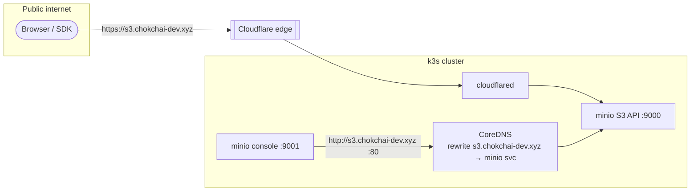

# MinIO

MinIO is the cluster's **S3-compatible object storage**: screenshots, file
shares, and anything blob-shaped that doesn't belong in Postgres. It is the
only core data service exposed publicly in two flavors — a web console and a
raw S3 API — and its setup includes a **CoreDNS hairpin** that makes
console-generated share links work from the public internet.

## Spec

| Property | Value |
|----------|-------|
| Image | `minio/minio:RELEASE.2025-04-22T22-12-26Z` |
| Workload | **StatefulSet**, `replicas: 1`, `serviceName: minio-headless` |
| Persistence | PVC `minio-data`, **10 Gi**, `local-path`, `ReadWriteOnce`, mounted at `/data` |
| Ports | `9000` (S3 API), `9001` (console) |
| Resources | requests `cpu: 50m`, `memory: 128Mi`; limit `memory: 512Mi` |
| Auth | `MINIO_ROOT_USER` / `MINIO_ROOT_PASSWORD` from secret `minio-auth` |
| Probes | `/minio/health/live` and `/minio/health/ready` on `:9000` |
| Namespace | `core` |

### Services

| Service | Type | DNS / port | Use |
|---------|------|------------|-----|
| `minio-headless` | headless (`clusterIP: None`) | `minio-headless.core.svc.cluster.local:9000` | StatefulSet identity |
| `minio` | ClusterIP | `minio.core.svc.cluster.local:9000` (api), `:80` (api-http), `:9001` (console) | app connections + the hairpin target |
| `minio-nodeport` | NodePort | node `:30900` (api), `:30901` (console) | LAN access |

### Secret bootstrap

Like `postgres-secret` and `redis-auth`, the credential is created **directly
in-cluster and never committed**:

```bash
kubectl create secret generic minio-auth -n core \
  --from-literal=username=<user> \
  --from-literal=password=<password>
```

Rotating it is the same command with `--dry-run=client -o yaml | kubectl apply -f -`
plus a pod restart (`kubectl rollout restart statefulset/minio -n core`).

## Public exposure

Two hostnames on the Cloudflare tunnel (see
[Networking & ingress](../infrastructure/networking.md)):

| Hostname | Target | Speaks |
|----------|--------|--------|
| `minio.chokchai-dev.xyz` | `minio.core.svc.cluster.local:9001` | the **console web app** (login UI, Share links, `/api/v1/...`) |
| `s3.chokchai-dev.xyz` | `minio.core.svc.cluster.local:9000` | **raw S3 protocol only** (SDKs, `mc`, presigned URLs) |

Rule of thumb: anything the console UI gives you stays on the `minio.` domain;
anything an S3 client signs goes to the `s3.` domain. Pasting a console path
onto the `s3.` domain fails with `NoSuchBucket`/`AccessDenied` — the API reads
`/api/v1/...` as a bucket named `api`.

## The CoreDNS hairpin (why share links work)

Two constraints collide behind a Cloudflare tunnel:

1. Console-generated **presigned/share URLs must be signed for the public
   hostname** (`s3.chokchai-dev.xyz`) — SigV4 covers the `Host`, so a URL
   signed for an internal name is invalid outside.
2. The console's **own S3 traffic must never travel through Cloudflare** —
   the edge proxy rewrites requests in a way that breaks MinIO's
   `aws-chunked` streaming signatures, and every bucket/object operation
   fails with *"The XML you provided was not well-formed"* (MalformedXML).

The fix is to give the pod network a different answer for
`s3.chokchai-dev.xyz` than the internet gets:



Three pieces, all in `homelab-flux-controller`:

1. **CoreDNS rewrite** — k3s's CoreDNS imports `/etc/coredns/custom/*.override`
   from an optional `coredns-custom` ConfigMap (`kube-system`). Ours
   (`infrastructure/networking/coredns/configmap-custom.yaml`) contains:

   ```
   rewrite stop {
     name exact s3.chokchai-dev.xyz minio.core.svc.cluster.local
     answer auto
   }
   ```

   Every pod resolving the public S3 hostname now gets the in-cluster service
   IP. (CoreDNS must be restarted to pick up ConfigMap changes:
   `kubectl rollout restart deployment/coredns -n kube-system`.)

2. **Port 80 on the `minio` Service** (→ `targetPort: 9000`) — so the
   hairpinned hostname works **without a port suffix** and the signed host is
   exactly `s3.chokchai-dev.xyz`, matching what Cloudflare forwards.

3. **`MINIO_SERVER_URL=http://s3.chokchai-dev.xyz`** on the StatefulSet — the
   console signs URLs for the public hostname, and it's `http` on purpose:
   SigV4 ignores the scheme, so the same signature validates when the link is
   opened as `https://` through the tunnel, while the console itself reaches
   port 80 directly in-cluster. `MINIO_BROWSER_REDIRECT_URL` stays
   `https://minio.chokchai-dev.xyz` for the console redirect.

:::warning Do not set MINIO_SERVER_URL to the https public URL
That was the first attempt. It routes the console's S3 calls out through the
Cloudflare edge and back, and every operation fails with MalformedXML (see
constraint 2 above). The hairpin exists precisely so the hostname can be
public *in signatures* but local *in routing*.
:::

## Sharing files

- **Share button in the console** → a link on
  `minio.chokchai-dev.xyz/api/v1/download-shared-object/<base64>`, valid for
  the chosen expiry (max 7 days), no login needed. The base64 blob is the
  underlying presigned URL for `s3.chokchai-dev.xyz` — decode it and swap
  `http://` → `https://` for a raw S3-domain link with the same expiry.
- **Permanent public URLs** — set a bucket's access to anonymous read
  (console: *Bucket → Anonymous → add `/` readonly*, or
  `mc anonymous set download local/<bucket>`). Objects are then served at
  `https://s3.chokchai-dev.xyz/<bucket>/<file>` forever, with real content
  types (images render inline). Treat such buckets as world-readable.
- Presigned URLs are bearer tokens: whoever has the link has the file until
  it expires. Only credential rotation revokes them early.
