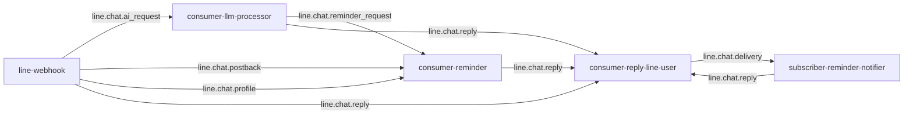

# NATS

[NATS](https://nats.io) is the message bus that couples all the services
together. Every inter-service interaction is a publish/subscribe on a NATS
subject — there are no direct HTTP calls between services.

## Spec

| Property | Value |
|----------|-------|
| Image | `nats:2.10-alpine` |
| Workload | Deployment, `replicas: 1` |
| Mode | **Core NATS only — no JetStream** (`-js` flag absent) |
| Persistence | **None** (config-only volume; state is in memory) |
| Ports | `4222` (client), `8222` (HTTP monitoring) |
| Resources | requests `cpu:50m`/`mem:64Mi`, limits `mem:256Mi` |
| Auth | user/password from secret `nats-auth`, wired via `nats-server.conf` |
| DNS | `nats.core.svc.cluster.local:4222` |
| Namespace | `core` |

**Why core NATS (no JetStream)?** The chat pipeline is fire-and-forget: if a
message is lost, the user simply resends. Durability would mean a persistent
volume and SD-card writes on a Pi that deliberately avoids them. The one place
that needs at-least-once semantics — reminder firing — gets it from **Postgres +
a recovery loop**, not from the broker (see the
[reminder system](/services/reminder-system)).

The monitoring endpoint is exposed publicly at `nats.chokchai-dev.xyz`
(port 8222) for `varz`/connection stats.

## Subject map

Every subject is consumed with a **queue subscription** (queue group = the
consumer's name), so adding a replica of any service would load-balance rather
than duplicate. Today every consumer runs a single replica.



| Subject | Published by | Subscribed by (queue group) |
|---------|--------------|------------------------------|
| `line.chat.ai_request` | line-webhook | consumer-llm-processor |
| `line.chat.reply` | line-webhook, consumer-llm-processor, consumer-reminder, subscriber-reminder-notifier | consumer-reply-line-user |
| `line.chat.reminder_request` | consumer-llm-processor | consumer-reminder |
| `line.chat.postback` | line-webhook | consumer-reminder |
| `line.chat.profile` | line-webhook | consumer-reminder |
| `line.chat.delivery` | consumer-reply-line-user | subscriber-reminder-notifier |

### Reading the map

- **`line.chat.reply` is the universal egress subject.** Four different services
  publish to it; only `consumer-reply-line-user` consumes it and talks to LINE.
  This is what keeps LINE API access in exactly one place.
- **`line.chat.delivery` closes the loop** for reminders: the reply consumer
  reports whether a push actually landed (including HTTP 429 quota errors), and
  the notifier records the outcome. See
  [push-quota 429](/runbooks/push-quota-429).
- **The webhook only ever publishes**; the reply consumer only publishes the
  delivery ack. The "thinking" services (llm-processor, consumer-reminder) both
  subscribe and publish.

## Event schemas

Payloads are small JSON structs kept as a copy in each service (monorepo
convention — no shared module). Common field conventions:

- `user_id` — the LINE user id (`U…`), always present.
- `reply_token` — LINE's one-shot token for replying to the triggering event.
  Empty on flows with no triggering user message (fired reminders); the reply
  consumer then falls back to push.
- `timestamp` — Unix **milliseconds** of the original LINE event.
- Fields marked *optional* carry `omitempty` — absent from the JSON when zero.

### `line.chat.ai_request`

line-webhook → consumer-llm-processor. One user message entering the AI
pipeline (chat, reminder trigger, or image).

| Field | Type | Required | Meaning |
|-------|------|----------|---------|
| `user_id` | string | yes | sender |
| `reply_token` | string | yes | reply token of the message |
| `text` | string | yes* | message text, AI prefix already stripped (*empty for image messages*) |
| `image_key` | string | optional | Redis key of an attached image (`image:<line-message-id>`), see [Redis](/data-services/redis) |
| `image_mime` | string | optional | MIME type of that image |
| `timestamp` | int64 (ms) | yes | LINE event time |

```json
{
  "user_id": "U4af4980629…",
  "reply_token": "8cf9239d398b…",
  "text": "explain kubernetes",
  "timestamp": 1784532531000
}
```

### `line.chat.reminder_request`

consumer-llm-processor → consumer-reminder. The language work is already
done: `message`/`remind_at` are what extraction found in `text`; either may be
absent, and the flow then asks the user for the missing part.

| Field | Type | Required | Meaning |
|-------|------|----------|---------|
| `user_id` | string | yes | creator |
| `reply_token` | string | yes | for the flow's next prompt |
| `text` | string | yes | the raw user text (kept for fallback/cancel words) |
| `message` | string | optional | extracted "what to remind" — multi-line preserved |
| `remind_at` | string (RFC3339, `+07:00`) | optional | extracted "when" |
| `timestamp` | int64 (ms) | yes | LINE event time |

```json
{
  "user_id": "U4af4980629…",
  "reply_token": "8cf9239d398b…",
  "text": "เตือนพรุ่งนี้ 9 โมง กินยา",
  "message": "กินยา",
  "remind_at": "2026-07-21T09:00:00+07:00",
  "timestamp": 1784532531000
}
```

### `line.chat.postback`

line-webhook → consumer-reminder. A quick-reply button press. `data` is
query-string style; only `flow=rem` payloads belong to consumer-reminder,
anything else is logged and dropped.

| Field | Type | Required | Meaning |
|-------|------|----------|---------|
| `user_id` | string | yes | who pressed the button |
| `reply_token` | string | yes | for the flow's next prompt |
| `data` | string | yes | e.g. `flow=rem&a=target&v=self`, `flow=rem&a=confirm`, `flow=rem&a=cancel` |
| `timestamp` | int64 (ms) | yes | LINE event time |

```json
{
  "user_id": "U4af4980629…",
  "reply_token": "b3c9a2f10d…",
  "data": "flow=rem&a=user&v=U8bb1907d31…",
  "timestamp": 1784532540000
}
```

### `line.chat.profile`

line-webhook → consumer-reminder. Keeps the `line_users` table fresh so the
"remind someone else" picker has display names. Published at most once per
user per 24 h (Redis profile gate).

| Field | Type | Required | Meaning |
|-------|------|----------|---------|
| `user_id` | string | yes | LINE user |
| `display_name` | string | yes | current LINE display name |
| `timestamp` | int64 (ms) | yes | fetch time |

```json
{ "user_id": "U4af4980629…", "display_name": "Meow", "timestamp": 1784532531000 }
```

### `line.chat.reply`

Everyone → consumer-reply-line-user. The universal egress event; the reply
consumer is the only service that talks to LINE. The message *shape* is
decided by which optional fields are set — publishers never ship pre-rendered
LINE JSON.

| Field | Type | Required | Meaning |
|-------|------|----------|---------|
| `user_id` | string | yes | recipient |
| `reply_token` | string | yes* | *empty → delivered via push instead of reply* |
| `text` | string | yes | message text; split on blank lines into ≤5000-char LINE messages |
| `image_key` | string | optional | generated image id — becomes an image message pointing at line-webhook's public `/images/<key>` |
| `quick_replies` | array | optional | buttons attached to the last message |
| `quick_replies[].label` | string | yes | button label (≤20 runes) |
| `quick_replies[].data` | string | yes | postback payload (comes back on `line.chat.postback`) |
| `quick_replies[].display_text` | string | optional | text shown in chat when pressed |
| `reminder_id` | int64 | optional | non-zero → publish a `line.chat.delivery` ack after the send attempt |
| `reminder` | object | optional | raw facts of a fired reminder — rendered as a flex bubble by the consumer |
| `reminder.message` | string | yes | what to remind |
| `reminder.creator_display_name` | string | optional | shown as "from …" |
| `reminder.remind_at` | string (RFC3339) | yes | scheduled time |

A flow prompt with buttons:

```json
{
  "user_id": "U4af4980629…",
  "reply_token": "8cf9239d398b…",
  "text": "จะให้เตือนใครดี? / Who is this reminder for?",
  "quick_replies": [
    { "label": "เตือนตัวเอง", "data": "flow=rem&a=target&v=self", "display_text": "เตือนตัวเอง" },
    { "label": "ยกเลิก", "data": "flow=rem&a=cancel", "display_text": "ยกเลิก" }
  ]
}
```

A fired reminder (no reply token → push; flex bubble built by the consumer):

```json
{
  "user_id": "U8bb1907d31…",
  "reply_token": "",
  "text": "",
  "reminder_id": 42,
  "reminder": {
    "message": "กินยา",
    "creator_display_name": "Meow",
    "remind_at": "2026-07-21T09:00:00+07:00"
  }
}
```

### `line.chat.delivery`

consumer-reply-line-user → subscriber-reminder-notifier. The delivery ack
that closes the reminder loop; published only when the reply event carried a
`reminder_id`.

| Field | Type | Required | Meaning |
|-------|------|----------|---------|
| `reminder_id` | int64 | yes | which reminder this ack is for |
| `ok` | bool | yes | did the send land |
| `error_code` | int | optional | HTTP status LINE returned — `429` = push quota exhausted, see [push-quota 429](/runbooks/push-quota-429) |
| `error` | string | optional | error detail |

```json
{ "reminder_id": 42, "ok": false, "error_code": 429, "error": "monthly push quota reached" }
```

Image bytes never ride on NATS (the default max message size rules it out) —
they travel through Redis, and only the key is sent. See [Redis](/data-services/redis)
and the [image flows sequence](/diagrams/sequence-image).
