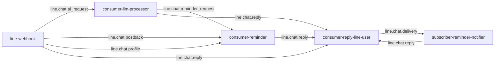

# NATS

[NATS](https://nats.io) is the message bus that couples all the services
together. Every inter-service interaction is a publish/subscribe on a NATS
subject — there are no direct HTTP calls between services.

## Spec

| Property | Value |
|----------|-------|
| Image | `nats:2.10-alpine` |
| Workload | Deployment, `replicas: 1` |
| Mode | **Core NATS only — no JetStream** (`-js` flag absent) |
| Persistence | **None** (config-only volume; state is in memory) |
| Ports | `4222` (client), `8222` (HTTP monitoring) |
| Resources | requests `cpu:50m`/`mem:64Mi`, limits `mem:256Mi` |
| Auth | user/password from secret `nats-auth`, wired via `nats-server.conf` |
| DNS | `nats.core.svc.cluster.local:4222` |
| Namespace | `core` |

**Why core NATS (no JetStream)?** The chat pipeline is fire-and-forget: if a
message is lost, the user simply resends. Durability would mean a persistent
volume and SD-card writes on a Pi that deliberately avoids them. The one place
that needs at-least-once semantics — reminder firing — gets it from **Postgres +
a recovery loop**, not from the broker (see the
[reminder system](/services/reminder-system)).

The monitoring endpoint is exposed publicly at `nats.chokchai-dev.xyz`
(port 8222) for `varz`/connection stats.

## Subject map

Every subject is consumed with a **queue subscription** (queue group = the
consumer's name), so adding a replica of any service would load-balance rather
than duplicate. Today every consumer runs a single replica.



| Subject | Published by | Subscribed by (queue group) |
|---------|--------------|------------------------------|
| `line.chat.ai_request` | line-webhook | consumer-llm-processor |
| `line.chat.reply` | line-webhook, consumer-llm-processor, consumer-reminder, subscriber-reminder-notifier | consumer-reply-line-user |
| `line.chat.reminder_request` | consumer-llm-processor | consumer-reminder |
| `line.chat.postback` | line-webhook | consumer-reminder |
| `line.chat.profile` | line-webhook | consumer-reminder |
| `line.chat.delivery` | consumer-reply-line-user | subscriber-reminder-notifier |

### Reading the map

- **`line.chat.reply` is the universal egress subject.** Four different services
  publish to it; only `consumer-reply-line-user` consumes it and talks to LINE.
  This is what keeps LINE API access in exactly one place.
- **`line.chat.delivery` closes the loop** for reminders: the reply consumer
  reports whether a push actually landed (including HTTP 429 quota errors), and
  the notifier records the outcome. See
  [push-quota 429](/runbooks/push-quota-429).
- **The webhook only ever publishes**; the reply consumer only publishes the
  delivery ack. The "thinking" services (llm-processor, consumer-reminder) both
  subscribe and publish.

## Event payloads

Payloads are small JSON structs kept as a copy in each service (monorepo
convention — no shared module). The canonical fields:

```go
// line.chat.ai_request  (line-webhook → consumer-llm-processor)
{ user_id, reply_token, text, image_key?, image_mime?, timestamp }

// line.chat.reminder_request  (consumer-llm-processor → consumer-reminder)
// message + remind_at are pre-extracted by the LLM processor
{ user_id, reply_token, text, message?, remind_at?, timestamp }

// line.chat.reply  (many → consumer-reply-line-user)
// `reminder`, when set, carries the raw facts for a fired reminder - the
// flex bubble is built by consumer-reply-line-user itself, never shipped
// pre-rendered on the wire.
{ user_id, reply_token, text, image_key?, quick_replies?, reminder_id?,
  reminder?: { message, creator_display_name?, remind_at } }

// line.chat.delivery  (consumer-reply-line-user → subscriber-reminder-notifier)
{ reminder_id, ok, error_code?, error? }
```

Image bytes never ride on NATS (the default max message size rules it out) —
they travel through Redis, and only the key is sent. See [Redis](/data-services/redis).
