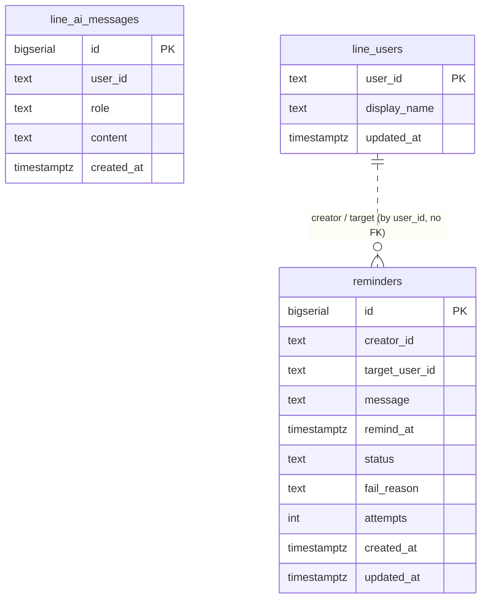

# Postgres

Postgres is the **source of truth** for everything durable: conversation
history, known users, and reminders. It's the only core data service with a
persistent volume.

## Spec

| Property | Value |
|----------|-------|
| Image | `postgres:15-alpine` |
| Workload | **StatefulSet**, `replicas: 1`, `serviceName: postgres-headless` |
| Persistence | PVC `postgres-data`, **5 Gi**, `local-path`, `ReadWriteOnce`, mounted at `/var/lib/postgresql/data` |
| Port | `5432` |
| Resources | **none set** (unconstrained — it's the durable core) |
| Auth | `POSTGRES_USER` / `POSTGRES_PASSWORD` / `POSTGRES_DB` from secret `postgres-secret` |
| Namespace | `core` |

### Services

| Service | Type | DNS | Use |
|---------|------|-----|-----|
| `postgres-headless` | headless (`clusterIP: None`) | `postgres-headless.core.svc.cluster.local:5432` | StatefulSet identity |
| `postgres` | ClusterIP | `postgres.core.svc.cluster.local:5432` | app connections (`DATABASE_URL`) |
| `postgres-nodeport` | NodePort 30432 | node:30432 | admin access from the LAN |

Application services connect via `DATABASE_URL` (in
`consumer-llm-processor-secret`), pointing at `postgres.core.svc.cluster.local`.

## Schema

There is **no migration framework** and no `.sql` files. Each owning service
embeds its `CREATE TABLE IF NOT EXISTS` DDL as a Go string constant and applies
it at startup with `pool.Exec`. Ownership:



### `line_ai_messages` — owned by consumer-llm-processor

Conversation history for the AI assistant, one row per turn. Indexed on
`(user_id, created_at)` for fast recent-history reads.

```sql
CREATE TABLE IF NOT EXISTS line_ai_messages (
    id         bigserial PRIMARY KEY,
    user_id    text        NOT NULL,
    role       text        NOT NULL,   -- 'user' | 'model'
    content    text        NOT NULL,
    created_at timestamptz NOT NULL DEFAULT now()
);
```

### `line_users` — owned by consumer-reminder

Maps a LINE user id to a display name, populated from profile events so the
reminder picker can show names instead of opaque ids.

```sql
CREATE TABLE IF NOT EXISTS line_users (
    user_id      text PRIMARY KEY,
    display_name text        NOT NULL,
    updated_at   timestamptz NOT NULL DEFAULT now()
);
```

### `reminders` — owned by consumer-reminder

The reminder records and their lifecycle state.

```sql
CREATE TABLE IF NOT EXISTS reminders (
    id             bigserial   PRIMARY KEY,
    creator_id     text        NOT NULL,
    target_user_id text        NOT NULL,
    message        text        NOT NULL,
    remind_at      timestamptz NOT NULL,        -- stored UTC; entered/shown Asia/Bangkok
    status         text        NOT NULL DEFAULT 'pending',
    fail_reason    text,
    attempts       int         NOT NULL DEFAULT 0,
    created_at     timestamptz NOT NULL DEFAULT now(),
    updated_at     timestamptz NOT NULL DEFAULT now()
);
CREATE INDEX IF NOT EXISTS idx_reminders_status_remind_at
    ON reminders (status, remind_at);
```

:::note Shared ownership caveat
`consumer-reminder` is the logical owner of `line_users` + `reminders`, but
`worker-reminder-scheduler` and `subscriber-reminder-notifier` embed the same
idempotent `reminders` DDL and run it at startup too. This removes any
deploy-ordering dependency between the three — whichever starts first creates the
table. The `status` column drives the whole reminder lifecycle, detailed on the
[reminder system](/services/reminder-system) page.
:::

## Durability posture

Postgres is the one thing that must survive a Pi reboot, so it gets the only
general-purpose PVC in `core` and no resource caps. Everything in
[Redis](/data-services/redis) is treated as a rebuildable cache of what's here —
the whole system can lose Redis and recover, but not Postgres.
