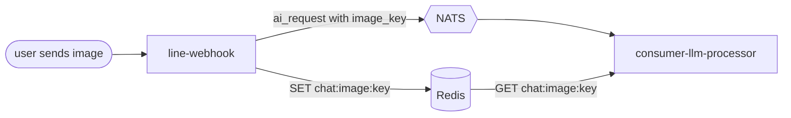
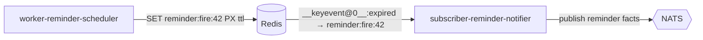

# Redis

Redis is the **fast, rebuildable** layer: a conversation-history cache, a set of
short-lived coordination keys (sessions, flow state), the image byte handoff
between services, and — crucially — the **timer** that fires reminders via
key-expiry events.

## Spec

| Property | Value |
|----------|-------|
| Image | `redis:7-alpine` |
| Workload | Deployment, `replicas: 1` |
| Persistence | **None** (no PVC — cache rebuilt from Postgres) |
| Memory policy | `--maxmemory 64mb --maxmemory-policy allkeys-lru` |
| Keyspace events | `--notify-keyspace-events Ex` (expiry events, for reminders) |
| Port | `6379` |
| Resources | requests `cpu:50m`/`mem:32Mi`, limits `mem:128Mi` |
| Auth | ACL user from secret `redis-auth` (default user disabled) |
| DNS | `redis.core.svc.cluster.local:6379` |
| Namespace | `core` |

The server runs with the default user **off** and a single ACL user
(`--user "$REDIS_USERNAME" on ">$REDIS_PASSWORD" "~*" "&*" "+@all"`) sourced from
`redis-auth`.

## Key schemes

| Key pattern | Owner / writer | TTL | Purpose |
|-------------|----------------|-----|---------|
| `chat:history:<uid>` | consumer-llm-processor | short cache | conversation-history cache (rebuilt from `line_ai_messages` on miss) |
| `chat:ai_session:<uid>` | line-webhook, consumer-reminder | 10m sliding | active AI session — while set, the webhook forwards free text to the pipeline |
| `chat:reminder_flow:<uid>` | consumer-reminder (read by llm-processor) | 10m | reminder conversation flow state (JSON) |
| `chat:profile_seen:<uid>` | line-webhook | 24h | gate so `GetProfile` is called at most once/day per user |
| `chat:image:<id>` | line-webhook → consumer-llm-processor | short | incoming user image bytes (the `image_key`) |
| `chat:genimage:<id>` | consumer-llm-processor → line-webhook | short | generated image bytes, served at `/images/<id>` |
| `reminder:fire:<id>` | worker-reminder-scheduler | = time-to-fire | **the reminder timer** — expiry triggers the notification |

## Two roles worth calling out

### 1. The image byte handoff

NATS message size makes shipping image bytes over the bus impractical, so images
travel through Redis and only the **key** rides on NATS:

The reverse path (generated images) uses `chat:genimage:<id>`, which line-webhook
serves publicly so LINE can fetch the picture by URL.

### 2. The reminder timer (key expiry)

This is the load-bearing trick of the reminder system. The scheduler `SET`s a
`reminder:fire:<id>` key with a TTL equal to the time until the reminder is due.
When it expires, Redis (with `notify-keyspace-events Ex`) publishes an event on
`__keyevent@0__:expired`, which `subscriber-reminder-notifier` is subscribed to:

:::caution allkeys-lru eviction
Under memory pressure the `allkeys-lru` policy may **evict** an armed
`reminder:fire:<id>` key. Eviction fires an `evicted` event, **not** `expired`,
so a reminder is never fired early. The scheduler's recovery pass catches the
missed fire and re-arms it — see the [reminder system](/services/reminder-system)
and the [fire sequence](/diagrams/sequence-reminder#firing-a-reminder).
:::

## Why no persistence?

Redis holds nothing that can't be reconstructed: `chat:history` rebuilds from
Postgres, sessions/flow-state are short-lived and safe to lose (the user just
restarts the interaction), and armed reminder keys are recovered from the
`reminders` table by the scheduler. Skipping the PVC avoids SD-card writes.

The one operational cost of this choice: **enabling keyspace notifications
requires a Redis restart, which drops all keys.** That's a managed event — see
the [Redis-restart runbook](/runbooks/redis-restart).
