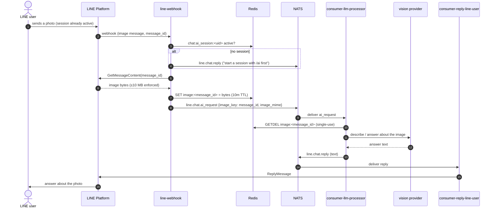
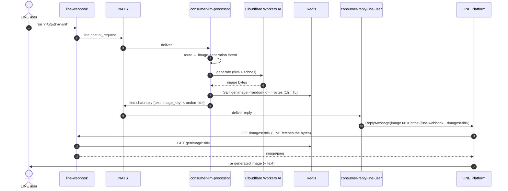

# Sequence: image flows

The two image-shaped flows of the LINE system: the user **sending** an image
for the AI to look at (vision), and the AI **generating** an image on request.
In both directions the actual bytes travel through **Redis**, never NATS —
only a key rides on the bus.

## User sends an image (vision)

Images are only accepted **inside an active AI session** — LINE image messages
carry no caption text, so without a session there is no signal that the user
wants the AI to look at it.

## AI generates an image

The difficulty router detects a "draw me…" intent and calls the image
provider (Cloudflare Workers AI, `flux-1-schnell`). The generated bytes are
stashed in Redis and served publicly by **line-webhook** at `/images/<id>` —
LINE's servers fetch the URL when delivering the image message.

## Notes

- **Why Redis for bytes:** NATS core has a small default max message size and
  no persistence; images are multi-megabyte and single-use. The key-in-event /
  bytes-in-Redis handoff keeps the bus light. See [Redis](/data-services/redis).
- **Incoming images are single-use** — the processor deletes the key as it
  reads it (`GETDEL` semantics), and the 10-minute TTL cleans up anything the
  processor never picked up.
- **The `/images/<id>` endpoint is unauthenticated by design.** The
  unguessable 128-bit random id is the access control, and the entry expires
  with its 1-hour Redis TTL — long after LINE's immediate fetch.
- **Generation provider:** Gemini's free tier dropped image models, so image
  generation runs on Cloudflare Workers AI's free tier (`flux-1-schnell`);
  chat/vision stay on the regular LLM provider chain.
