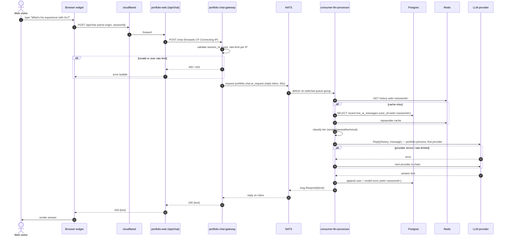
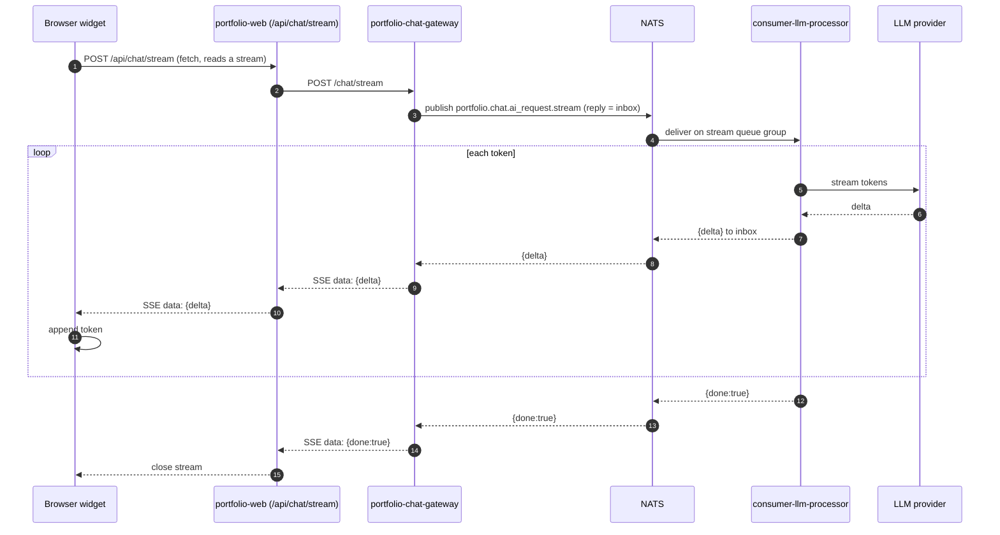

# Sequence: Portfolio chat message

What happens from a visitor typing in the website's chat widget to the answer
appearing. See the [portfolio web chatbot](/services/portfolio-chatbot) page for
the component-level view, and contrast with the LINE
[AI chat sequence](/diagrams/sequence-ai-chat) — the pipeline is the same, but
the transport is **synchronous request-reply** instead of fire-and-forget.

## Notes on the tricky steps

- **Same-origin proxy (steps 2–4):** the browser never talks to the gateway
  directly. `portfolio-web`'s route handler relays the call server-side, so the
  gateway stays ClusterIP-only (no public hostname, no CORS). The visitor's real
  IP is carried in `CF-Connecting-IP` for the gateway's rate limiter.
- **Guardrails before NATS (steps 5–6):** validation and the per-IP token bucket
  run at the gateway, so malformed or abusive traffic never reaches the LLM
  pipeline or burns free-tier quota.
- **Request-reply (steps 7, 20):** the gateway blocks on `nc.Request(...)` and
  the consumer answers with `msg.Respond(...)` on the auto-generated inbox. There
  is no `reply` subject and no delivery service — contrast steps 19–22 of the
  LINE sequence, where a separate consumer-reply-line-user delivers the answer.
- **Shared store, namespaced key (steps 9–12, 18):** history lives in the same
  `line_ai_messages` table as LINE, keyed `web:<sessionId>`. The `web:` prefix
  keeps channels from colliding; the widget's "clear chat" sends `/reset`, which
  clears exactly that key.
- **Same brain, different persona (steps 13–17):** identical classifier and
  provider-fallback logic as LINE, but the system prompt is the professional
  portfolio persona. Image/reminder intents are answered with a polite redirect
  rather than executed on this channel.
- **Timeouts:** the gateway's request timeout sits *above* the consumer's own
  generate timeout, so a slow provider chain still yields a friendly answer
  rather than a bare gateway `504`.

## Streaming variant (the default)

The diagram above is the unary `POST /chat`. The widget actually defaults to the
**streaming** endpoint, which changes only the transport, not the pipeline:

- **Reply inbox, not request-reply:** the gateway publishes with a fresh inbox
  as the reply subject and drains `StreamChunk` frames from it, forwarding each
  as an SSE `data:` line; the stream ends on the `{done:true}` frame.
- **Fallback only before the first token:** the router may still switch
  providers on an early failure, but once any delta has been streamed the answer
  is committed — a later failure ends the stream (a terminating frame carries
  the error) rather than restarting on another model.
- **Same store & persona:** history keying (`web:<sessionId>`), the portfolio
  persona, and the image/reminder redirect are identical to the unary path;
  only the delivery is incremental.
