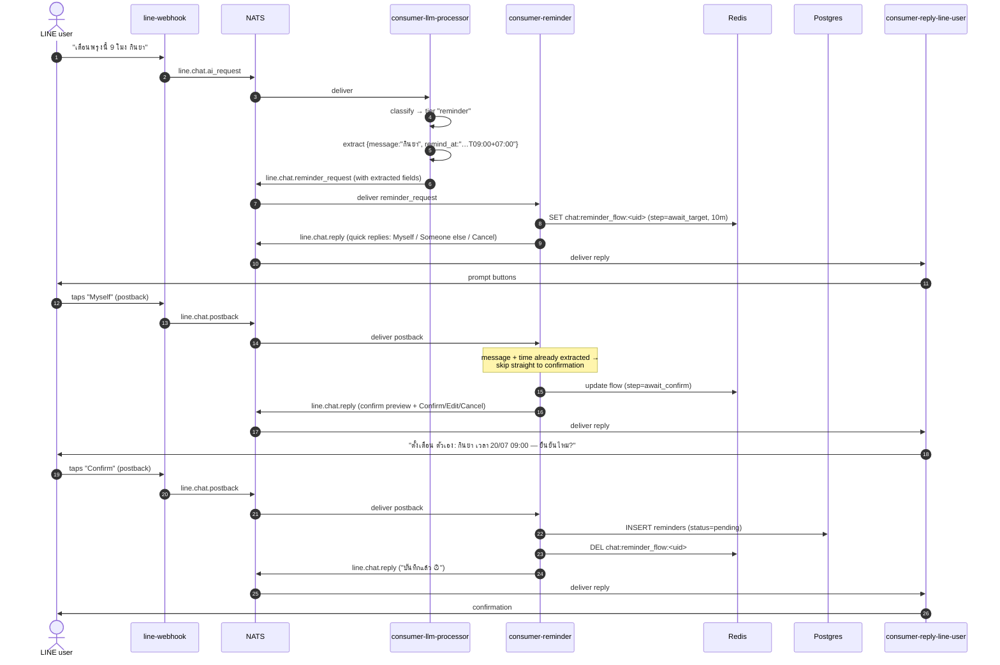

# Sequence: creating a reminder

From "remind me tomorrow 9am to take medicine" to a `pending` row in the
`reminders` table. This is the conversational half of the
[reminder system](/services/reminder-system); the firing half is the
[next sequence](/diagrams/sequence-reminder-fire).

## Notes

- **Extraction lives in the LLM processor (steps 4–6)**, not in
  consumer-reminder. The reminder service receives structured
  `{message, remind_at}` and never calls an LLM itself. If extraction found only
  part (say, no time), consumer-reminder asks the user for the missing piece
  during `await_details`.
- **"Someone else" branch:** picking *Someone else* instead of *Myself* inserts
  an `await_user` step that lists known users from `line_users` as quick-reply
  buttons (display names, not ids), then proceeds to details/confirm.
- **Free-text steps route back through the webhook.** While
  `chat:reminder_flow:<uid>` exists, the webhook keeps forwarding the user's
  typed text (via the refreshed `chat:ai_session`), and the LLM processor routes
  it to consumer-reminder rather than answering it as chat.
- **The reply token is free here.** Every step in creation is a direct response
  to a user action, so it uses the reply token — no push quota is consumed.
  Firing later is what needs push (next page).
