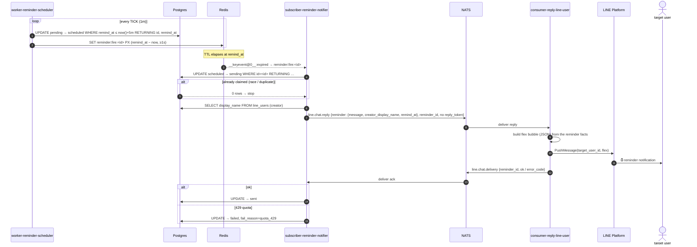
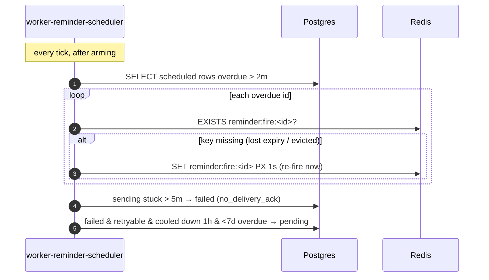

# Sequence: firing a reminder

From a `pending` row to a flex-message notification in the user's chat — the
time-based half of the [reminder system](/services/reminder-system). This path
has no reply token (the user didn't just message us), so delivery uses **push**.
Note that subscriber-reminder-notifier never builds a LINE message itself — it
ships the raw reminder facts, and consumer-reply-line-user renders the flex
bubble, the same as it renders every other message shape in the system.

## Recovery paths (not shown above)

Redis expiry events are **at-most-once**, and an armed key can be evicted under
memory pressure. The scheduler's recovery pass (same 1-minute tick) is the
safety net:

## Notes

- **The claim is atomic** (`UPDATE … WHERE status='scheduled' RETURNING`). If
  two events or two replicas race, only one gets rows; the other stops. This is
  what makes "fire exactly once" hold without broker durability.
- **Flex rendering lives in consumer-reply-line-user, not the notifier.** The
  notifier's job ends at "here are the facts"; the reply consumer is the only
  service that knows LINE message shapes (flex, quick-replies, text splitting).
  This is the same separation the [creation flow](/diagrams/sequence-reminder-create)
  already follows — consumer-reminder never touches LINE directly either.
- **No reply token → push.** Because firing isn't a response to a user message,
  the notifier sends with an empty reply token, so consumer-reply-line-user
  goes straight to push — which is quota-limited. See
  [push-quota 429](/runbooks/push-quota-429).
- **The delivery-ack roundtrip is the only way failures become visible.**
  Without it the notifier couldn't tell a landed push from a dropped one, and the
  scheduler couldn't retry quota failures.
- **Everything reconciles from Postgres.** Lose Redis entirely and the next
  scheduler tick re-arms every `scheduled` row — no reminders are lost, only
  slightly delayed.
