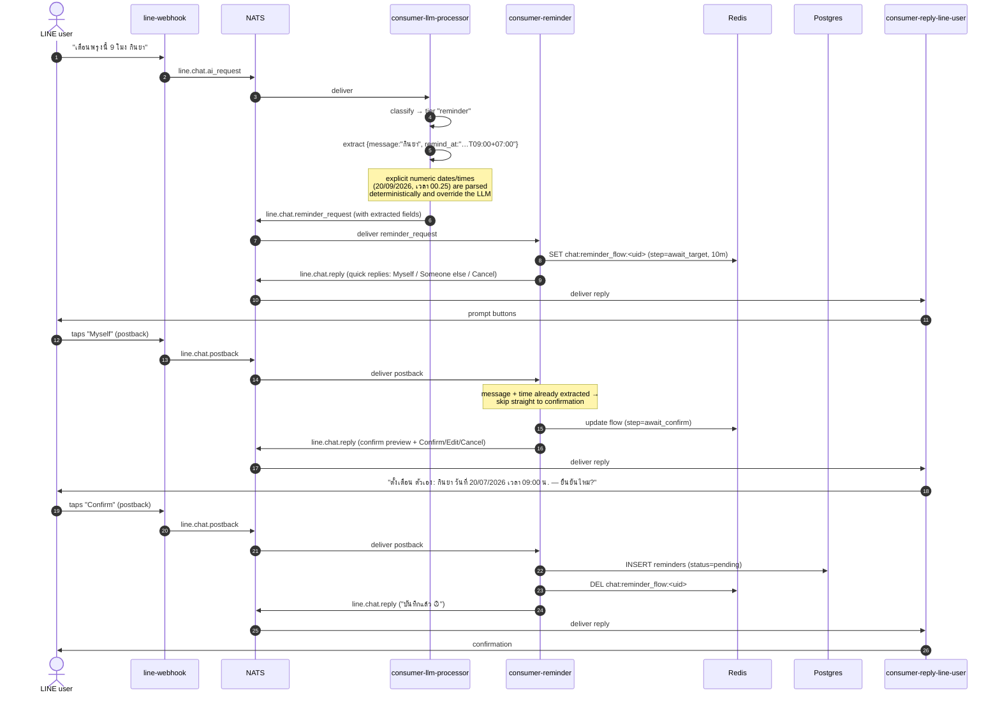
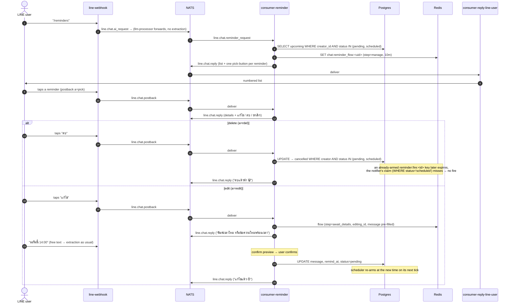
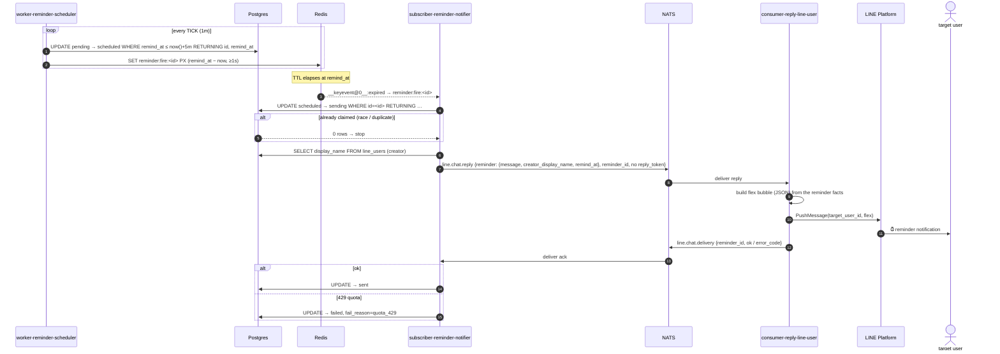
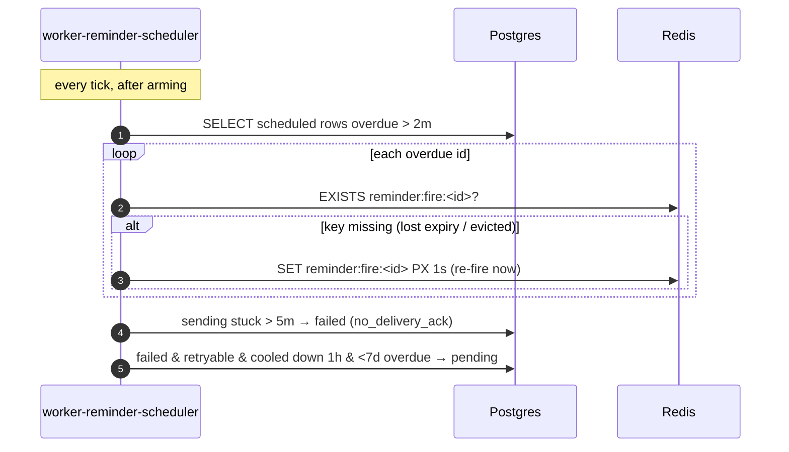

# Sequence: reminder lifecycle

The two halves of the [reminder system](/services/reminder-system) in one
place: **creating** a reminder (conversational, reply-token based) and
**firing** it (time-based, push based).

## Creating a reminder

From "remind me tomorrow 9am to take medicine" to a `pending` row in the
`reminders` table.

### Notes on creation

- **Extraction lives in the LLM processor (steps 4–6)**, not in
  consumer-reminder. The reminder service receives structured
  `{message, remind_at}` and never calls an LLM itself. If extraction found only
  part (say, no time), consumer-reminder asks the user for the missing piece
  during `await_details`.
- **"Someone else" branch:** picking *Someone else* instead of *Myself* inserts
  an `await_user` step that lists known users from `line_users` as quick-reply
  buttons (display names, not ids), then proceeds to details/confirm.
- **Free-text steps route back through the webhook.** While
  `chat:reminder_flow:<uid>` exists, the webhook forwards the user's typed text
  into the AI pipeline (it checks that key directly — no AI session is opened),
  and the LLM processor routes it to consumer-reminder rather than answering it
  as chat. When the flow ends, the key dies and routing stops with it.
- **Typing `ยกเลิก` (or `cancel`) works at any step**, same as the Cancel
  button — see [Commands & keywords](/services/commands).
- **The reply token is free here.** Every step in creation is a direct response
  to a user action, so it uses the reply token — no push quota is consumed.
  Firing later is what needs push (below).

## Managing reminders

`/reminders` (or `ดูเตือน`) lists the creator's upcoming reminders; picking
one offers edit or delete. Both operations lean on the same status-guarded
claims that make firing race-free.

## Firing a reminder

From a `pending` row to a flex-message notification in the user's chat. This
path has no reply token (the user didn't just message us), so delivery uses
**push**. Note that subscriber-reminder-notifier never builds a LINE message
itself — it ships the raw reminder facts, and consumer-reply-line-user renders
the flex bubble, the same as it renders every other message shape in the
system.

### Recovery paths (not shown above)

Redis expiry events are **at-most-once**, and an armed key can be evicted under
memory pressure. The scheduler's recovery pass (same 1-minute tick) is the
safety net:

### Notes on firing

- **The claim is atomic** (`UPDATE … WHERE status='scheduled' RETURNING`). If
  two events or two replicas race, only one gets rows; the other stops. This is
  what makes "fire exactly once" hold without broker durability.
- **Flex rendering lives in consumer-reply-line-user, not the notifier.** The
  notifier's job ends at "here are the facts"; the reply consumer is the only
  service that knows LINE message shapes (flex, quick-replies, text splitting).
  This is the same separation the creation flow above already follows —
  consumer-reminder never touches LINE directly either.
- **No reply token → push.** Because firing isn't a response to a user message,
  the notifier sends with an empty reply token, so consumer-reply-line-user
  goes straight to push — which is quota-limited. See
  [push-quota 429](/runbooks/push-quota-429).
- **The delivery-ack roundtrip is the only way failures become visible.**
  Without it the notifier couldn't tell a landed push from a dropped one, and the
  scheduler couldn't retry quota failures.
- **Everything reconciles from Postgres.** Lose Redis entirely and the next
  scheduler tick re-arms every `scheduled` row — no reminders are lost, only
  slightly delayed.
