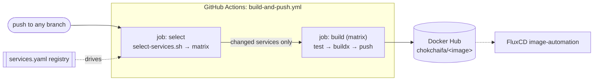

# CI/CD pipeline

Continuous integration lives entirely in `homelab-monorepo` as a single GitHub
Actions workflow. Its contract is narrow: **on a push, build and push a
correctly-tagged Docker image for every changed service.** Deployment is
FluxCD's job (CD lives in the other repo).



## The service registry (`services.yaml`)

`services.yaml` is the **single source of truth** for the build. Each entry
declares everything CI needs; adding a service is a registry edit, never a
workflow edit:

```yaml
- name: consumer-reminder          # logical name (matches the Flux app)
  image: consumer-reminder         # Docker Hub repo → chokchaifa/consumer-reminder
  context: services/consumer-reminder
  dockerfile: build/go/Dockerfile  # SHARED per-stack Dockerfile
  versionFile: services/consumer-reminder/VERSION
  platforms: linux/amd64,linux/arm64
  buildArgs:
    GO_VERSION: "1.25"
    MAIN_PATH: "./"
    PORT: "8080"
  test: "go test ./..."
  paths:                           # a push touching these rebuilds this service
    - "services/consumer-reminder/**"
    - "build/go/**"                # editing the shared Dockerfile rebuilds all
```

## Change detection (`scripts/select-services.sh`)

The `select` job runs `select-services.sh`, which:

1. Loads the registry with `yq`.
2. On a **push**, diffs the changed files (`git diff BEFORE AFTER`) against each
   service's `paths` globs (converted to anchored regexes) and selects the
   matches. On a **manual `workflow_dispatch`**, it takes `all` or an explicit
   comma-separated list.
3. Emits a GitHub Actions matrix (`include`) plus a `count`. If `count == 0`,
   the build job is skipped.

Because every service's `paths` includes its shared Dockerfile directory
(`build/go/**` or `build/node-next/**` or `build/docusaurus/**`), editing a
shared Dockerfile correctly rebuilds every service on that stack.

## Build & push (`build` job)

For each selected service the matrix job:

1. Sets up the toolchain from `matrix` (Go from the service's `go.mod`, or Node)
   and runs `matrix.test` (e.g. `go test ./...`) if set.
2. Computes the tag:
   ```bash
   VERSION="$(tr -d '[:space:]' < "${VERSION_FILE}")"   # semver core from VERSION
   SHORT_SHA="$(git rev-parse --short HEAD)"
   TAG="v${VERSION}-${GITHUB_RUN_NUMBER}.${SHORT_SHA}"  # e.g. v1.0.0-142.9fa46c8
   ```
3. Builds multi-arch (`linux/amd64,linux/arm64`) with Docker Buildx and pushes
   to `docker.io/chokchaifa/<image>:<tag>`.

### The tag scheme matters

```text
v1.0.0-142.9fa46c8
│ │     │   └── short commit SHA (traceability)
│ │     └────── GitHub run number (monotonic → newest build always wins)
│ └──────────── semver core from the service's VERSION file
└────────────── matches Flux's ImagePolicy pattern ^v[0-9]+\.[0-9]+\.[0-9]+.*$
```

The monotonic run number is what lets FluxCD's semver ImagePolicy always pick
the latest build without a human bumping anything. See
[GitOps → image automation](/infrastructure/gitops-fluxcd) and the
[VERSION ↔ image contract](/runbooks/rollout-waves).

## Multi-arch without QEMU

The Pi is arm64, but CI runners are amd64. The shared **Go** Dockerfile pins its
builder stage to `--platform=$BUILDPLATFORM` and lets the Go compiler
**cross-compile** to `TARGETARCH` (`CGO_ENABLED=0`), with the runtime stage
copying only the static binary + CA certs — so **no QEMU emulation** is ever
needed. The **Node** and **Docusaurus** stacks rely on `*-alpine` base images,
which ship native amd64 + arm64 manifests.

:::note Required GitHub secrets
`DOCKER_USERNAME` (`chokchaifa`, also the image namespace) and `DOCKER_PASSWORD`
(a Docker Hub access token). Nothing else is needed — the pipeline pushes images
and stops there.
:::
