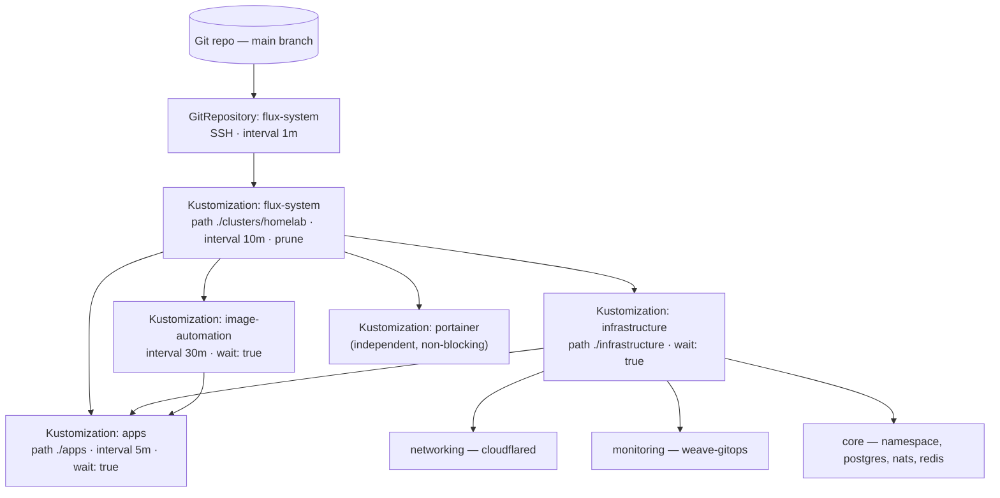
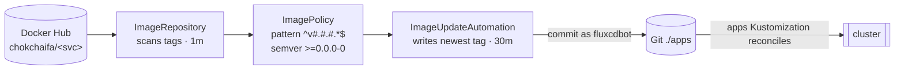

# GitOps with FluxCD

The cluster is managed **declaratively**. Nothing is applied by hand — the
desired state lives in `homelab-flux-controller`, and **FluxCD v2.7.0**
continuously reconciles the cluster to match it. A push to `main` is the only
deploy mechanism.

## The reconciliation chain

Flux watches the repo via a `GitRepository` and applies a tree of nested
`Kustomization` objects, each with its own sync interval and dependency order.



**Dependency ordering is the important part:** the `apps` Kustomization declares
`dependsOn: [infrastructure, image-automation]` and `wait: true`. Flux will not
apply a single application workload until the data services (Postgres, NATS,
Redis) are healthy and the image-automation objects exist. `portainer` is
deliberately its own top-level Kustomization with no `wait`/`dependsOn`, so a
slow or failing UI install can never block the business apps.

### The objects

| Kustomization | Path | Interval | wait | dependsOn |
|---------------|------|----------|------|-----------|
| `flux-system` (root) | `./clusters/homelab` | 10m | — | — |
| `infrastructure` | `./infrastructure` | 10m | ✅ | — |
| `image-automation` | `./clusters/homelab/apps/image-automation` | 30m | ✅ | — |
| `apps` | `./apps` | 5m | ✅ | `infrastructure`, `image-automation` |
| `portainer` | `./infrastructure/monitoring/portainer` | 30m | — | — |

The `GitRepository` polls `main` every **1 minute** over SSH; the root
Kustomization reconciles every **10 minutes** (or immediately, on demand — see
the [reconciliation runbook](/runbooks/reconciliation)). `prune: true`
everywhere means deleting a manifest from Git deletes it from the cluster.

## Image automation — auto-deploy without touching Git by hand

New application images are rolled out automatically. For each service, three
objects under `clusters/homelab/apps/image-automation/<service>/` cooperate:



- The **ImageRepository** scans the Docker Hub repo every minute.
- The **ImagePolicy** selects the newest tag matching
  `^v[0-9]+\.[0-9]+\.[0-9]+.*$` under semver range `>=0.0.0-0`. Because the CI
  tag format is `v<VERSION>-<run>.<sha>` with a **monotonic run number**, the
  newest build always wins.
- The **ImageUpdateAutomation** writes that tag back into the
  `deployment.yaml` (via a `# {"$imagepolicy": "flux-system:<svc>"}` setter
  marker), commits to `main` as `fluxcdbot`, and the `apps` Kustomization then
  rolls the Deployment.

This is why a deployment's image line looks like:

```yaml
image: chokchaifa/consumer-reminder:v1.0.0-25.3cfe245 # {"$imagepolicy": "flux-system:consumer-reminder"}
```

The human never edits that tag after the first bootstrap — image-automation
owns it.

## Reliability tuning for the Pi

The `clusters/homelab/flux-system/kustomization.yaml` patches **every Flux
controller Deployment** to relax its liveness probe
(`initialDelaySeconds: 30`, `timeoutSeconds: 10`, `periodSeconds: 30`,
`failureThreshold: 6`). Under slow SD-card I/O the default 1-second probe timed
out and sent the controllers into CrashLoopBackOff. This patch is load-bearing —
don't remove it.
