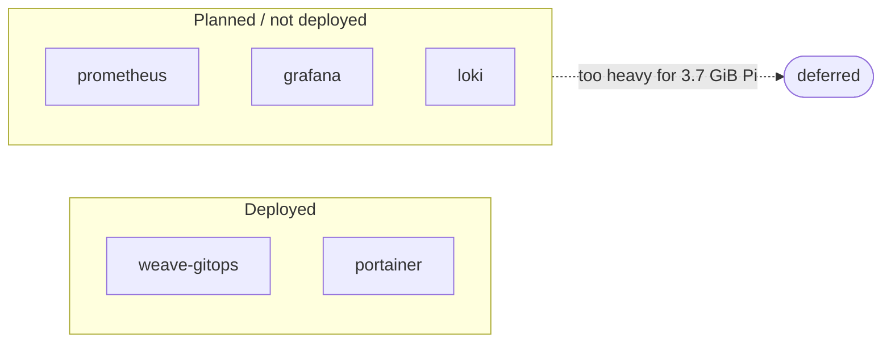

# Monitoring & dashboards

The cluster exposes two management UIs, both installed as Helm releases via Flux
and reached through the [cloudflared tunnel](/infrastructure/networking).
Metrics stacks (Prometheus/Grafana/Loki) are noted as planned but **not
currently deployed** — on a 3.7 GiB Pi they're a deliberate omission.

## Weave GitOps — the Flux dashboard

A read-only-ish web UI over FluxCD: see every Kustomization, GitRepository,
HelmRelease, and image-automation object, their sync status, and reconcile them
from the browser.

| Property | Value |
|----------|-------|
| Install | `HelmRelease weave-gitops` (chart `weave-gitops` **4.0.36**, OCI `ghcr.io/weaveworks/charts`) |
| Namespace | `flux-system` |
| Service | `NodePort` 9001 (nodePort 30090) |
| Public URL | `weaver-gitops.chokchai-dev.xyz` |
| Resources | requests `cpu:100m`/`mem:64Mi`, limits `cpu:1000m`/`mem:1Gi` |
| Hardening | drop ALL caps, `readOnlyRootFilesystem`, `runAsNonRoot` (uid 1000) |
| Auth | admin user `admin`, bcrypt password hash committed in the HelmRelease values |

This is the fastest way to answer "did my push actually roll out?" — it shows
the same reconciliation state described in the
[reconciliation runbook](/runbooks/reconciliation), visually.

## Portainer — the container/cluster UI

A general Kubernetes/container management UI (workloads, logs, exec, events).

| Property | Value |
|----------|-------|
| Install | `HelmRelease portainer` (chart `portainer` **`>=239.0.0`**, `https://portainer.github.io/k8s/`) |
| Namespace | `portainer` (Helm `createNamespace: true`) |
| Service | `ClusterIP` 9000 |
| Public URL | `portainer.chokchai-dev.xyz` |
| Persistence | 2 Gi `local-path` PVC (Portainer's own BoltDB state) |
| Resources | requests `cpu:100m`/`mem:128Mi`, limits `mem:256Mi` |

Portainer is deployed by its **own independent Flux Kustomization**
(`clusters/homelab/apps/portainer.yaml`) with **no `wait`/`dependsOn`**, so a
slow or failing UI install never blocks the application rollout. It was chosen
over Rancher specifically because Rancher's first-boot catalog git-restore step
starved the Pi's SD-card I/O.

## What's intentionally missing

Observability today is: Weave GitOps for reconciliation state, Portainer for
workloads/logs, the NATS monitoring endpoint (`nats.chokchai-dev.xyz`, port
8222) for broker stats, and `kubectl` / structured service logs (zerolog) for
everything else. A full metrics stack is deferred until the workload moves off a
single Pi.
