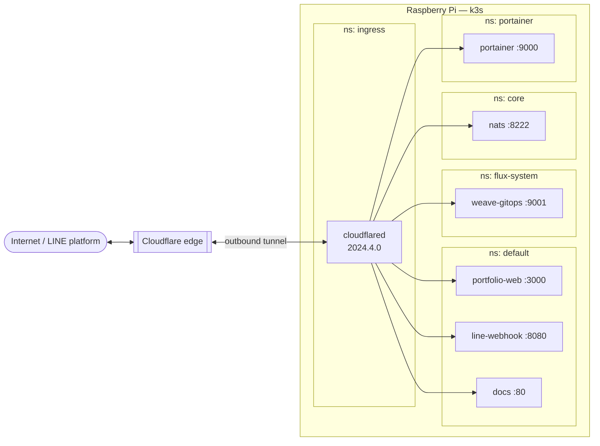

# Networking & ingress

Traefik is disabled. The cluster has **no traditional ingress controller and no
open inbound ports** on the Pi. Instead, a **Cloudflare Tunnel** (`cloudflared`)
dials *out* to Cloudflare and receives traffic for a set of hostnames, forwarding
each to an in-cluster Service. This is how LINE's webhooks and every dashboard
reach the cluster without port-forwarding or a public IP.

## cloudflared deployment

| Property | Value |
|----------|-------|
| Namespace | `ingress` |
| Image | `cloudflare/cloudflared:2024.4.0` |
| Replicas | 1 |
| Resources | limits `cpu: 100m`, `memory: 128Mi` |
| Credentials | mounted from the host via **hostPath** (`/home/chokchai/.cloudflared/<tunnel-uuid>.json`) |
| Config | `ConfigMap` `cloudflared-config` mounted at `/etc/cloudflared/tunnel-config.yml` |

The tunnel credentials are deliberately **not** in Git — they're a host file
mounted into the pod, consistent with the single-node design.

## Hostname → Service map

The tunnel config (`infrastructure/networking/ingress/configmap-tunnel.yaml`)
maps public hostnames to cluster-internal Service DNS names:

| Hostname | Target Service |
|----------|----------------|
| `portfolio.chokchai-dev.xyz` | `portfolio-web.default.svc.cluster.local:3000` |
| `line-webhook.chokchai-dev.xyz` | `line-webhook.default.svc.cluster.local:8080` |
| `docs.chokchai-dev.xyz` | `docs.default.svc.cluster.local:80` |
| `weaver-gitops.chokchai-dev.xyz` | `weave-gitops.flux-system.svc.cluster.local:9001` |
| `portainer.chokchai-dev.xyz` | `portainer.portainer.svc.cluster.local:9000` |
| `codeserver.chokchai-dev.xyz` | `code-server.code-server.svc.cluster.local:8080` |
| `nats.chokchai-dev.xyz` | `nats.core.svc.cluster.local:8222` (monitoring UI) |
| *(catch-all)* | `http_status:404` |

:::info Adding a hostname
Two steps: (1) add a `- hostname: … / service: http://<svc>.<ns>.svc.cluster.local:<port>`
entry to the tunnel ConfigMap **above the catch-all 404**, and (2) create a
Cloudflare DNS CNAME for that hostname pointing at the tunnel (done out-of-band
in the Cloudflare dashboard — it is not a repo change). The `docs` hostname was
added exactly this way.
:::

## Why a tunnel instead of ingress + LoadBalancer?

- **No public IP required.** The Pi sits behind a home router; the tunnel makes
  outbound connections only.
- **TLS is terminated at Cloudflare's edge**, so no cert management on-cluster.
- **Nothing is exposed by accident** — only the hostnames explicitly listed in
  the ConfigMap are reachable; everything else 404s.
