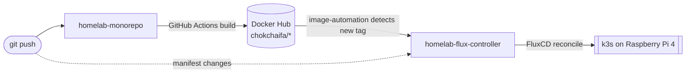

# Homelab

This is the documentation for a self-hosted homelab: a **single-node k3s
cluster running on a Raspberry Pi 4**, managed entirely through GitOps with
FluxCD, hosting a **LINE chatbot with an AI assistant and a reminder system**
built as event-driven Go microservices.

## The two-repo model

The homelab is split across two Git repositories with a clean **CI here, CD
there** boundary:

| Repo | Responsibility |
|------|----------------|
| [`homelab-monorepo`](https://github.com/chokchai-fa/homelab-monorepo) | Application source code (Go services + a Next.js portfolio + this docs site). GitHub Actions builds and pushes Docker images. Its job ends at "push a correctly-tagged image". |
| [`homelab-flux-controller`](https://github.com/chokchai-fa/homelab-flux-controller) | The desired state of the cluster as YAML. FluxCD continuously reconciles the cluster to match, and its image-automation controller auto-rolls new image tags. |

## How to read these docs

The documentation is organized by layer, from the metal up:

- **[Architecture](/architecture/overview)** — the whole system on one page, and
  where everything lives.
- **[Infrastructure](/infrastructure/k3s-cluster)** — the k3s cluster, the
  FluxCD GitOps machinery, the CI/CD pipeline, networking, and monitoring.
- **[Data services](/data-services/nats)** — NATS, Postgres, and Redis: their
  specs, the messaging contract, and the data model.
- **[Services](/services/line-chatbot)** — the LINE AI chatbot and the reminder
  system, described as architecture.
- **[Sequence diagrams](/diagrams/sequence-ai-chat)** — the load-bearing
  behaviors, step by step.
- **[Runbooks](/runbooks/reconciliation)** — the operational knowledge:
  reconciliation, the LINE push-quota constraint, the Redis-restart caveat, and
  rollout ordering.

:::note
The `README.md` files inside each repo predate parts of the current system and
are partially stale. **These docs are the source of truth**; spec numbers here
are quoted from the live manifests and service code.
:::
