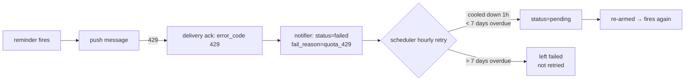

# Runbook: the LINE push-quota constraint

The LINE Messaging API has two ways to send a message, and they have very
different cost:

| Method | Cost | When usable |
|--------|------|-------------|
| **Reply** (reply token) | free, unlimited | only within ~1 minute of a user's message, once per token |
| **Push** (by user id) | counts against a **monthly quota** | any time |

Anything the system sends **that is not a direct answer to a just-received
message** must use push. That's exactly the case for **fired reminders** — the
user set them earlier, so there's no fresh reply token.

## Symptom

Reminders stop being delivered and the logs / `reminders` table show:

```text
deliver: push message failed  error=linebot: APIError 429 You have reached your monthly limit.
```

and rows land in `status=failed, fail_reason=quota_429`.

## Why it self-heals

This is handled by design — you generally **don't** need to intervene:



- The `line.chat.delivery` ack carries the `429` code, so the notifier records
  `quota_429` rather than a generic failure.
- `worker-reminder-scheduler` retries `quota_429` rows **hourly** (a cheap
  `UPDATE … → pending`). As soon as the monthly quota resets, the next retry
  delivers.
- Rows more than **7 days** overdue are abandoned — delivering a week-old
  reminder isn't worth burning the fresh quota on stale content.

## What you can actually do

- **Wait for the monthly reset** — the backlog drains itself.
- **Reduce push consumption:** the chatbot already prefers reply tokens and packs
  long answers into ≤5 messages. The main push consumers are fired reminders.
- **Raise the ceiling:** upgrade the LINE OA plan, or (if messaging your own
  small user set) accept the free-tier limit.
- **Inspect the backlog:**
  ```sql
  SELECT status, fail_reason, count(*)
  FROM reminders GROUP BY 1, 2 ORDER BY 1;
  -- watch quota_429 rows flip back to pending after the reset
  ```

:::note
Reminder **creation** (the quick-reply flow) never hits this — every step there
is a reply-token response. Only **firing** consumes push. See the
[fire sequence](/diagrams/sequence-reminder-fire).
:::
