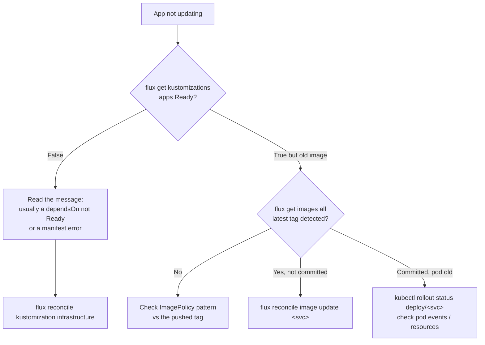

# Runbook: forcing a reconcile & checking status

By default Flux polls Git every minute and reconciles on its own intervals (see
[GitOps](/infrastructure/gitops-fluxcd)). When you don't want to wait — or when
something looks stuck — here's how to inspect and nudge it.

## Check status

```bash
# All Flux Kustomizations and whether they're Ready
flux get kustomizations

# Image automation: what tags Flux sees and last write
flux get images all

# A specific app's Deployment + pods
kubectl -n default get deploy,pods -l app=consumer-reminder
```

Or open **Weave GitOps** at `weaver-gitops.chokchai-dev.xyz` for the same
information visually ([monitoring](/infrastructure/monitoring)).

## Force an immediate sync

```bash
# Re-pull the Git repo right now (don't wait for the 1m interval)
flux reconcile source git flux-system

# Then reconcile the layer you care about (waits for it to finish)
flux reconcile kustomization infrastructure
flux reconcile kustomization apps
```

`flux reconcile kustomization apps` respects the `dependsOn` order, so it will
ensure `infrastructure` and `image-automation` are healthy first.

## Force an image-automation pass

If a new image tag was pushed and you don't want to wait up to 30 minutes:

```bash
flux reconcile image repository <service>          # rescan Docker Hub tags
flux reconcile image update <service>              # write newest tag to Git & commit
```

## When an app won't roll



Common causes on this cluster:

- **`apps` blocked on `infrastructure`.** `apps` has `wait: true` +
  `dependsOn: infrastructure`. If a data service is unhealthy (e.g. a missing
  [secret](/infrastructure/secrets-bootstrap)), no app will roll. Fix infra
  first.
- **Tag doesn't match the ImagePolicy.** The policy pattern is
  `^v[0-9]+\.[0-9]+\.[0-9]+.*$`. A manually pushed image without that shape is
  invisible to automation.
- **Pod pending on the Pi.** Single node with tight memory — check
  `kubectl describe pod` for scheduling/OOM events.

## Suspend / resume (maintenance)

```bash
flux suspend kustomization apps      # stop reconciling (e.g. during a manual test)
flux resume kustomization apps
```

Remember to resume — a suspended Kustomization silently ignores Git changes.
