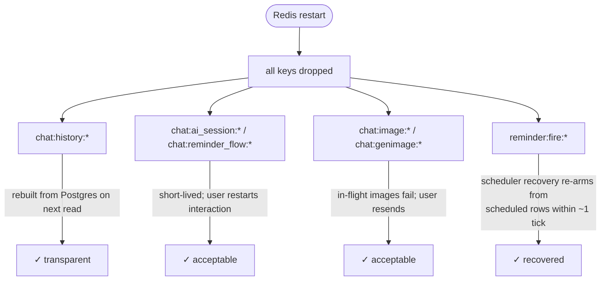

# Runbook: restarting Redis (and the keyspace-events caveat)

Redis has **no persistent volume** ([by design](/data-services/redis)), so any
restart drops **every key**. This is safe — everything is rebuildable — but it's
worth knowing exactly what happens and when a restart is required.

## When a restart is needed

The main trigger is enabling **keyspace notifications**, which the reminder
firing path depends on:

```text
--notify-keyspace-events Ex
```

This flag is set declaratively in
`infrastructure/core/redis/deployment.yaml`. Applying it (or any other change to
the Redis args/image) rolls the Deployment, which restarts the server. The
`subscriber-reminder-notifier` also issues a best-effort `CONFIG SET
notify-keyspace-events Ex` at startup as a belt-and-braces fallback, but the
declarative flag is the source of truth.

## What is lost on restart



| Lost keys | Impact | Recovery |
|-----------|--------|----------|
| `chat:history:*` | none visible | rebuilt from `line_ai_messages` on next read |
| `chat:ai_session:*` | in-flight AI sessions end | user sends `/ai` again |
| `chat:reminder_flow:*` | in-flight reminder flows drop | user gets "start again", re-runs `/reminder` |
| `chat:image:*`, `chat:genimage:*` | in-flight image ops fail | user resends the image |
| `reminder:fire:*` | armed timers lost | **scheduler recovery re-arms** from `scheduled` rows (grace ~2 min) |

No reminder is lost: the timers live in Redis but the **records** live in
Postgres, and `worker-reminder-scheduler` re-arms every `scheduled` row it finds
without a live key.

## Procedure

Do it in a **quiet window** (few active sessions, no reminders due in the next
couple of minutes):

```bash
# 1. Apply the manifest change via GitOps (preferred) — push to main, then:
flux reconcile kustomization infrastructure

# …or restart directly for an ad-hoc change:
kubectl -n core rollout restart deploy/redis
kubectl -n core rollout status  deploy/redis

# 2. Verify keyspace notifications are on
kubectl -n core exec deploy/redis -- \
  redis-cli -u "redis://<user>:<pass>@127.0.0.1:6379" config get notify-keyspace-events
# expect: "xE" or a value containing E (generic) and expired events

# 3. Confirm the notifier reconnected
kubectl -n default logs deploy/subscriber-reminder-notifier --tail=20
# look for: "listening for expired reminder keys"

# 4. (Optional) confirm reminders re-arm within a tick
kubectl -n default logs deploy/worker-reminder-scheduler --tail=20
```

## Sequencing with the notifier

If you're enabling keyspace events for the **first time**, apply the Redis flag
**before** relying on the notifier to fire anything. Until the flag is on, no
`expired` events are emitted; the scheduler's recovery pass will still eventually
re-fire overdue reminders, but real-time firing needs the flag live.
