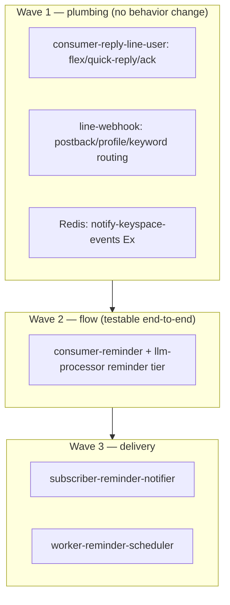
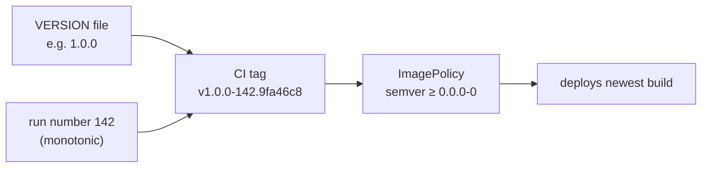

# Runbook: rollout waves & the VERSION ↔ image contract

Two related disciplines keep deployments smooth on a single, resource-tight Pi:
**wave-based rollout** (don't start everything at once) and the **VERSION ↔
image contract** (so Flux always deploys the build you intend).

## Wave-based rollout

Flux already enforces the top-level order — `apps` won't start until
`infrastructure` is healthy ([GitOps](/infrastructure/gitops-fluxcd)). Within a
feature that spans several new services, roll them out in **dependency waves** so
a cold start doesn't hit the node with every image pull and DB/Redis connection
at once, and so consumers exist before producers publish to them.

The reminder system was shipped in exactly this order:

Principles:

- **Deploy the consumer before the producer.** e.g. teach
  consumer-reply-line-user to render flex/quick-replies **before** anything
  publishes them — otherwise the new event shape is dropped.
- **Additive event fields only.** All the new NATS payload fields are
  `omitempty`, so old and new binaries interoperate during a partial rollout.
- **One service at a time on a cold cluster.** The Pi can't absorb six
  simultaneous image pulls + startup DB connections; stagger them.

## The VERSION ↔ image contract

CI builds tags as `v<VERSION>-<run>.<sha>` where `<VERSION>` is the semver core
from the service's `VERSION` file and `<run>` is the monotonic GitHub run number
([CI/CD](/infrastructure/cicd-pipeline)). Flux's ImagePolicy selects the newest
by semver.

Rules that keep this honest:

- **Never hand-edit the image tag** in a Flux `deployment.yaml` after the first
  bootstrap — image-automation owns it (the `# {"$imagepolicy": …}` marker).
- **First deploy of a brand-new service needs a real, already-pushed tag.** The
  setter marker can only rewrite an existing tag, so: merge the monorepo change
  (CI builds `v1.0.0-<run>.<sha>`), then point the new Flux `deployment.yaml` at
  that real tag when you add the app manifests.
- **Bump `VERSION` only for a semver-meaningful change.** Day-to-day, the run
  number already guarantees "newest wins"; you bump `VERSION` to signal a
  minor/major boundary, not for every commit.

## New-service checklist

To add a service end-to-end (this is what the docs site itself followed):

1. **monorepo:** create `services/<name>/` (or `apps/<name>/`) with a `VERSION`,
   append an entry to `services.yaml`. Merge → CI builds the first image.
2. **flux-controller:** add `apps/<name>/` (deployment + service + kustomization,
   image = the real CI tag + setter marker), register it in
   `apps/kustomization.yaml`; add the `image-automation/<name>/` set and register
   it. Merge.
3. **networking (if public):** add a tunnel hostname + a Cloudflare DNS record.
4. **secrets (if any):** `kubectl create secret …` before the pod starts.
