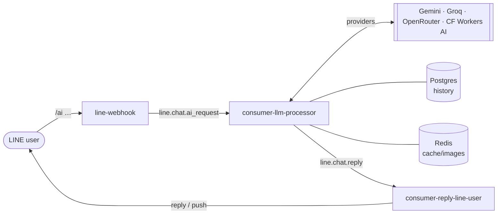
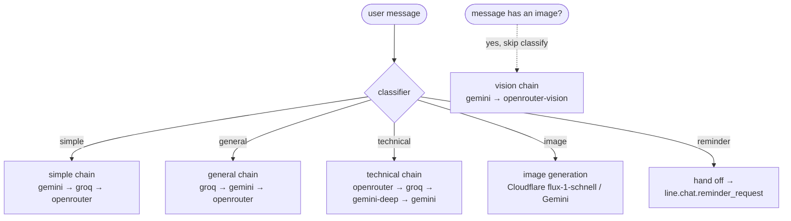

# LINE AI chatbot

The chatbot lets a LINE user talk to an AI assistant, send images for the AI to
look at, and ask it to generate pictures. It spans three services —
**line-webhook** (ingress), **consumer-llm-processor** (the brain), and
**consumer-reply-line-user** (egress) — plus Postgres for memory and Redis for
sessions and image handoff.

:::note One brain, multiple channels
This page describes the **LINE channel**. The same **consumer-llm-processor**
pipeline also answers the [portfolio web chatbot](/services/portfolio-chatbot)
over NATS request-reply. The classify → route → memory core is shared; only the
ingress/egress and persona differ.
:::

For the full step-by-step, see the [AI chat sequence](/diagrams/sequence-ai-chat).

## Session model

The webhook only forwards messages to the AI when the user is in an **AI
session**. `/ai` (or `/ai <question>`) starts one by setting
`chat:ai_session:<uid>` in Redis with a **10-minute sliding TTL**; while it's
live, every message is forwarded without a prefix. `/ai-end` ends it, and it
auto-expires after 10 minutes of silence. This keeps ordinary chatter out of the
(paid) LLM path.

## The difficulty router

consumer-llm-processor doesn't send every message to the same model. A tiny
**classifier** LLM labels each message, and the label selects a **provider
chain** — the first provider to answer wins, and any error (including rate
limits) falls through to the next. This is what keeps the whole thing inside
free tiers.

| Tier | Meaning | Chain (first success wins) |
|------|---------|----------------------------|
| `simple` | greetings, small talk | gemini → groq → openrouter |
| `general` | everyday factual/advice | groq → gemini → openrouter |
| `technical` | code, math, multi-step reasoning | openrouter → groq → gemini-deep → gemini |
| `image` | "draw me a…" | Cloudflare Workers AI (`flux-1-schnell`), Gemini fallback |
| `reminder` | "remind me…" | **not answered here** — republished to consumer-reminder |
| *vision* | any message carrying an image | gemini → openrouter-vision (classification skipped) |

The **reminder** tier is special: llm-processor doesn't converse, it **extracts**
the reminder's message + time and hands off to
[consumer-reminder](/services/reminder-system). That keeps all reminder business
logic out of the router.

## Conversation memory

History lives in `line_ai_messages` (Postgres), cached in `chat:history:<uid>`
(Redis) for speed. Each turn appends a `user` row and a `model` row. `/reset`
(also `ล้าง`, `เริ่มใหม่`) clears it.

## Debouncing bursts

Users often send several quick messages in a row. consumer-llm-processor buffers
a user's burst for `DEBOUNCE_WINDOW` (default 5s, capped at `DEBOUNCE_MAX_WAIT`
15s) and answers it as **one** merged request — cutting cost and avoiding
interleaved replies. Reminder-path traffic bypasses the debouncer so flow steps
feel instant.

## Image generation & vision

- **Vision** (user sends a photo): the webhook downloads the image, stashes the
  bytes in `chat:image:<id>` (Redis), and forwards only the key. The router
  skips classification and uses the vision chain.
- **Generation** ("วาดรูป…"): the image tier calls Cloudflare Workers AI
  (`@cf/black-forest-labs/flux-1-schnell`, free tier). The result is stashed in
  `chat:genimage:<id>` and served publicly by line-webhook so LINE can fetch it
  as an image message.

## Delivery

consumer-reply-line-user is the **only** service that calls the LINE API. It
tries the free **reply token** first and falls back to **push** (quota-limited).
It renders text, images, [flex messages, and quick-reply buttons](/services/reminder-system),
and long answers are packed into ≤5 messages so they fit the reply token. See
the [push-quota runbook](/runbooks/push-quota-429) for the push-limit caveat.
