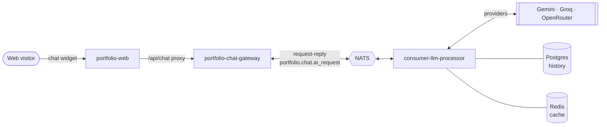
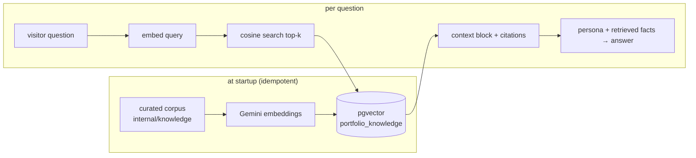

# Portfolio web chatbot

The **"Ask AI about me"** widget on the
[portfolio site](https://portfolio.chokchai-dev.xyz) lets a visitor ask about
Chokchai's experience, skills, research and projects and get an answer from the
same AI pipeline that powers the LINE bot. It reuses
**consumer-llm-processor** wholesale; the only new piece is an HTTP entry point,
**portfolio-chat-gateway**, that bridges the browser to NATS.

For the full step-by-step, see the
[portfolio chat sequence](/diagrams/sequence-portfolio-chat).

## Why request-reply, not fire-and-forget

The LINE channel is asynchronous: LINE only needs a fast webhook ack, and the
answer is delivered later by a separate egress service (consumer-reply-line-user)
over a reply token. A **web visitor is different — they are holding an open HTTP
request** and expect the answer on it.

So the web channel uses **NATS request-reply**: the gateway calls
`nc.Request("portfolio.chat.ai_request", …)` and consumer-llm-processor answers
with `msg.Respond(…)` on the auto-generated reply inbox. There is **no reply
subject, no correlation bookkeeping, and no downstream delivery service** — the
answer travels straight back to the waiting gateway. This is the single
architectural difference from the LINE flow; everything downstream (classifier,
provider chains, conversation memory) is identical.

## Streaming (SSE)

By default the widget uses the **streaming** path so the answer renders
token-by-token instead of appearing all at once after a pause — the biggest
perceived-latency win for a chat UI.

Because NATS request-reply is single-response, streaming uses a slightly
different NATS shape: the gateway opens a **reply inbox** and publishes on
`portfolio.chat.ai_request.stream` with that inbox as the reply subject; the
consumer streams the LLM's output as a series of `StreamChunk` frames
(`{delta}` … `{done:true}`) to the inbox. The gateway forwards each frame to
the browser as a **Server-Sent Event** (`text/event-stream`), and the widget
appends each delta as it arrives.

- **Provider streaming:** Gemini (`GenerateContentStream`) and the
  OpenAI-compatible providers (Groq/OpenRouter, `stream:true` SSE) stream
  natively; any provider without streaming support is emitted as a single
  delta, so the path works for every provider.
- **Fallback safety:** the difficulty router still falls back to the next
  provider on failure, but **only before the first token is emitted**. Once the
  visitor has seen partial output the answer is committed to that provider — a
  mid-stream failure ends the stream rather than silently restarting on a
  different model.
- **Unary path kept:** `POST /chat` (whole-answer request-reply) remains for
  non-streaming callers and as a fallback contract.

## Components

### portfolio-web
The Next.js portfolio site. Two chat-related pieces:

- **`components/chat/ChatWidget.tsx`** — a floating client-side widget:
  streaming (token-by-token) answers, **Markdown rendering** (bold, lists,
  fenced code blocks), suggested-question chips, a first-visit **discovery
  nudge**, a live **"answered from my homelab" status dot**, and "clear chat".
  It generates a session UUID once and keeps it in `localStorage`.
- **Route handlers** (same-origin proxies to the gateway's in-cluster URL
  `CHAT_GATEWAY_URL`, keeping the gateway private with no CORS; all forward
  `CF-Connecting-IP` so rate limiting sees the real visitor):
  - `app/api/chat/stream/route.ts` — pipes the gateway's SSE stream through
    unbuffered (the default path).
  - `app/api/chat/route.ts` — the unary whole-answer proxy.
  - `app/api/chat/status/route.ts` — proxies `GET /status` for the status card.

### portfolio-chat-gateway
A small Go/Echo service — the web channel's **ingress and egress in one**. It:

- exposes `POST /chat/stream` (SSE, the default), `POST /chat` (whole answer),
  `GET /status` (live homelab health for the widget card), and `GET /healthz`;
- **validates** the session id shape and message size, and **rate-limits per
  visitor IP** (one token bucket shared by both chat endpoints, default 10/min)
  to protect the free-tier LLM quotas behind it;
- relays each accepted message over NATS and maps failures to clean HTTP codes:
  `400` invalid input, `429` rate-limited, `503` NATS unavailable, `504` the
  pipeline took too long (streaming failures after the SSE stream has opened
  arrive as a terminating error frame instead).

It is **ClusterIP-only** — portfolio-web's `/api/chat` proxy is its sole caller,
so it never faces the public internet and stays off the cloudflared tunnel.

### consumer-llm-processor (the `webchat` channel)
A second NATS subscription (`internal/webchat`) on `portfolio.chat.ai_request`,
answered with `msg.Respond`. It shares the difficulty router, provider chains and
conversation store with the LINE path, but:

- uses a **professional portfolio persona** (`PortfolioPersonaInstruction`) with
  Chokchai's résumé facts embedded in the system prompt — including the correct
  Thai spelling of his name and his InCIT 2025 paper — instead of the LINE
  persona;
- stores history under **`web:<session_id>`**, so web conversations never
  collide with LINE user ids in the shared `line_ai_messages` table, and `/reset`
  (the widget's "clear chat") works the same way;
- **skips the LINE-only features** — no debounce, no reminder handoff, no image
  input/generation. If the shared classifier tags a web message as a reminder or
  image request, the channel answers with a short "I'm a Q&A assistant" redirect
  rather than acting on it.

## Retrieval-augmented generation (RAG)

On top of the persona's baseline facts, the web channel can **retrieve** the
most relevant chunks of a curated corpus and inject them into the prompt, so
answers stay grounded and can **cite a source**. It's optional and
feature-flagged (`RAG_ENABLED`): when off — or on any startup failure — the
chat falls back to the persona facts alone, so RAG never becomes a hard
dependency.

- **Corpus** (`internal/knowledge`): small, single-topic chunks derived from the
  résumé and site (roles, education, the GitCoFL/InCIT 2025 paper, skills,
  awards, the homelab). Each has a stable ID and a source label for citations.
- **Ingestion**: at startup the service embeds any **changed** chunks (detected
  by content hash) and upserts them into the `portfolio_knowledge` pgvector
  table — so restarts are cheap and edits re-embed only what moved.
- **Retrieval**: the question is embedded and matched by cosine distance;
  results past `RAG_MAX_DISTANCE` are dropped so an off-topic question pulls in
  nothing. The top-k chunks become a context block ("use these facts and cite
  the source") prepended to the question **sent to the model** — the raw
  question is still what gets stored in history.
- **Graceful degradation**: no pgvector extension, no embeddings quota, or
  `RAG_ENABLED=false` → the retriever is simply absent and the persona answers
  alone. Enabling it before the pgvector rollout finishes is safe.

:::note Persona facts are the floor, not the ceiling
The persona still carries the core facts as a baseline (so the chat works with
RAG off). As the corpus grows, RAG supplies depth and citations on top. Adding a
new fact ideally means adding a `knowledge` chunk; the persona only needs the
essentials.
:::

## Configuration

| Where | Key | Purpose |
|-------|-----|---------|
| portfolio-web | `CHAT_GATEWAY_URL` | In-cluster gateway base URL for the `/api/chat` proxy |
| portfolio-chat-gateway | `NATS_*` | Connection to NATS (request-reply) |
| portfolio-chat-gateway | `RATE_LIMIT_PER_MIN` | Per-visitor-IP message budget (default 10) |
| portfolio-chat-gateway | `MAX_MESSAGE_CHARS` | Reject oversize messages (default 1000) |
| portfolio-chat-gateway | `REQUEST_TIMEOUT` | NATS round-trip bound; kept above the consumer's generate timeout |
| consumer-llm-processor | *(shared)* | Same env as the LINE path — one process serves both channels |

## Failure behavior

- **NATS down / no responder** → gateway returns `503`; the widget shows a
  friendly "temporarily unavailable" bubble. The portfolio pages themselves are
  static and stay up regardless.
- **Pipeline slow** → `504` after `REQUEST_TIMEOUT`; the consumer's own generate
  timeout is set lower so it usually returns a friendly answer first.
- **Abuse / quota protection** → per-IP rate limit at the gateway plus the
  message-size cap; the provider fallback chain absorbs individual LLM 429s.
