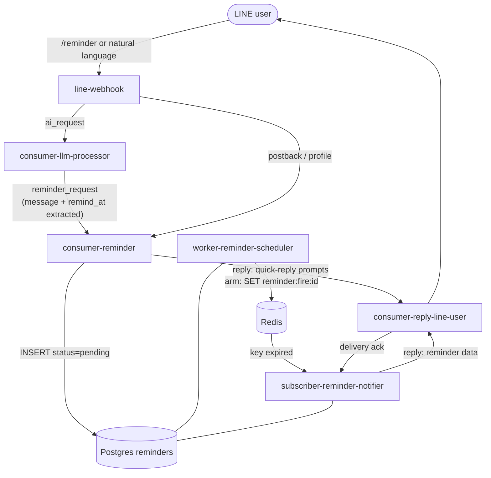
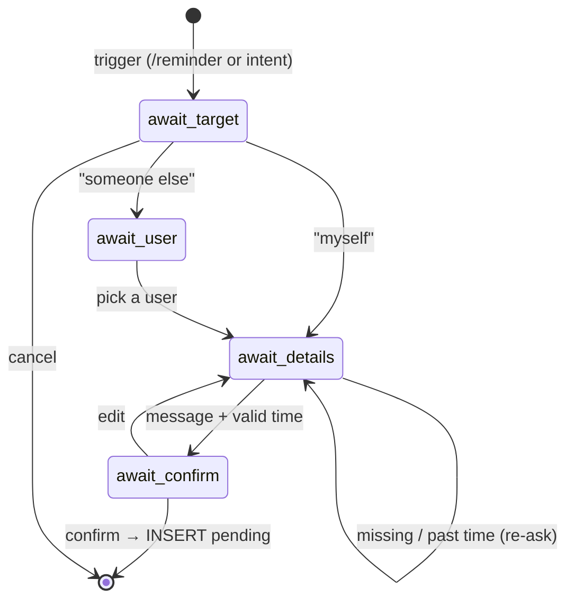
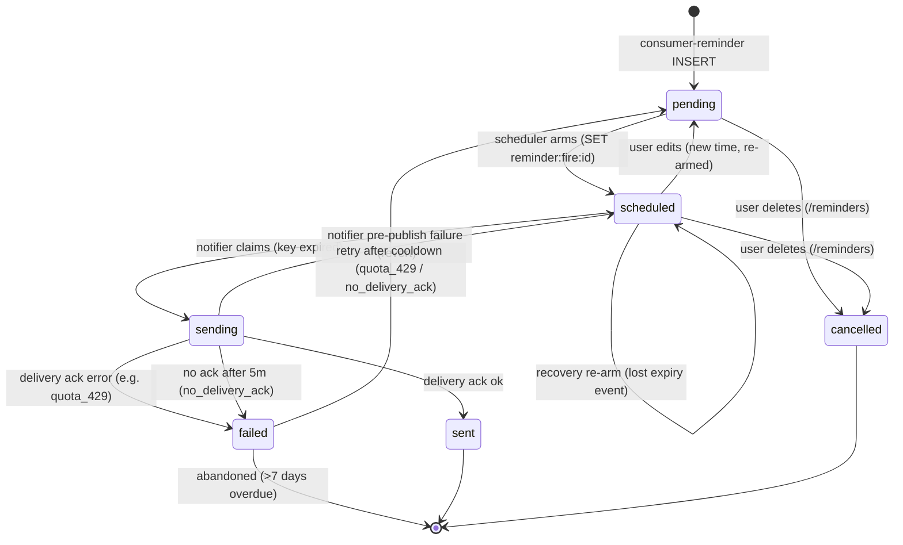

# Reminder system

The reminder system lets a user say "remind me (or someone else) to do X at time
T", and delivers a **flex-message notification** at that time. It is split so
that the AI router only *detects and extracts*, while a dedicated service owns
all reminder logic, and two more services handle the time-based firing.

## Responsibilities

| Service | Owns |
|---------|------|
| **consumer-llm-processor** | Detects reminder intent, extracts `{message, remind_at}` (Asia/Bangkok, RFC3339). Does **not** run the flow. |
| **consumer-reminder** | The conversation flow, the `line_users` + `reminders` tables. Never calls an LLM. |
| **worker-reminder-scheduler** | Arms due reminders as expiring Redis keys; repairs drift. |
| **subscriber-reminder-notifier** | Turns key-expiry into a `line.chat.reply` carrying the raw reminder facts (message, creator name, time); records delivery outcome. Never builds LINE-specific message shapes. |
| **consumer-reply-line-user** | Renders the flex bubble template from those facts and delivers it (push, since firing has no reply token). The only service that builds LINE message shapes. |

## The creation flow

A reminder is created through a short quick-reply conversation, driven by
consumer-reminder and rendered by consumer-reply-line-user as LINE quick-reply
buttons + postbacks. Full detail in the
[create sequence](/diagrams/sequence-reminder#creating-a-reminder).

Flow state lives in `chat:reminder_flow:<uid>` (Redis, 10 min TTL); the webhook
checks that key directly to keep forwarding the user's free text while the flow
is alive (no AI session is opened). If the state expires mid-conversation, the
user gets a friendly "start again" message — never a silent drop.

Users can also **list, edit, and delete** their upcoming reminders with
`/reminders` (or `ดูเตือน`) — see
[Commands & keywords](/services/commands#reminders) and the sequence notes in
the [reminder lifecycle](/diagrams/sequence-reminder#managing-reminders).

## The status lifecycle

Once saved, a reminder moves through `status` values driven by the scheduler and
notifier. This state machine is the heart of the "fire exactly once, eventually"
guarantee built on a non-durable broker.

| Transition | Trigger | Where |
|------------|---------|-------|
| `pending → scheduled` | due within `ARM_HORIZON` (5m) | scheduler arm pass |
| `scheduled → sending` | `reminder:fire:<id>` expired, claimed | notifier |
| `sending → sent` | delivery ack `ok` | notifier |
| `sending → failed` | delivery ack error (`quota_429`, `line_<code>`) | notifier |
| `scheduled → scheduled` | lost expiry event re-armed | scheduler recovery |
| `sending → failed` | no ack after 5m (`no_delivery_ack`) | scheduler repair |
| `pending/scheduled → cancelled` | user deletes via `/reminders` | consumer-reminder |
| `scheduled → pending` | user edits via `/reminders` (re-armed at new time) | consumer-reminder |

Deletes and edits are safe against an already-armed Redis timer **because every
notifier claim is status-guarded**: when the old timer expires, the claim
(`UPDATE … WHERE status='scheduled'`) finds a `cancelled` (or re-`pending`ed)
row, gets 0 rows, and stops. Nothing fires at a deleted or old time.
| `failed → pending` | retry after 1h cooldown (retryable reasons only) | scheduler repair |

## Why this many moving parts?

Firing a reminder at a precise time, exactly once, on top of a broker with **no
persistence** and a push channel with a **monthly quota**, needs defense in
depth:

- **Postgres is the ledger.** Every state lives in a row; Redis only holds the
  *timer*. Lose Redis and the scheduler rebuilds the timers from `scheduled`
  rows.
- **The scheduler is the safety net.** Redis expiry events are at-most-once and
  keys can be evicted; the scheduler's recovery pass re-arms anything that should
  have fired but didn't (grace ~2 min).
- **The delivery ack makes failures visible.** A scheduled reminder has no reply
  token, so it must go out via **push** — and push is quota-limited. The
  `line.chat.delivery` ack tells the notifier whether the push landed; a `429`
  becomes `quota_429` and is retried hourly until the quota resets. See the
  [push-quota runbook](/runbooks/push-quota-429).
- **All time math uses Postgres `now()`**, never the Pi's clock, so drift can't
  skip or double-fire; only the Redis TTL uses the local clock (clamped ≥1s).
- **LINE message construction lives in exactly one place.** subscriber-reminder-notifier
  ships raw facts (`message`, `creator_display_name`, `remind_at`), not a
  pre-rendered flex bubble; consumer-reply-line-user owns the template. This
  mirrors the [webhook/reply split](/architecture/overview) elsewhere in the
  system — the service that talks to the LINE API is the only one that knows
  its message shapes.
