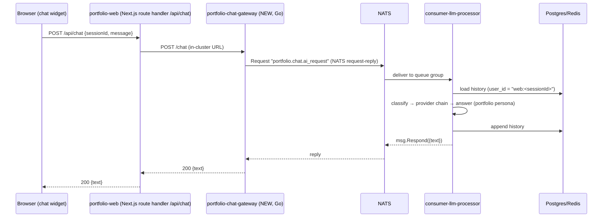

# Portfolio Web — Chatbot Integration Plan (the "wow" feature)

Goal: add an **"Ask AI about me"** chatbot to `portfolio.chokchai-dev.xyz` that
answers visitors' (recruiters', collaborators') questions about Chokchai's
experience, projects, and this homelab — **reusing the existing
`consumer-llm-processor`** (difficulty router + free-tier provider chain +
conversation store) plus **one new server** (a chat gateway), deployed the same
GitOps way as everything else.

---

## 1. Current-state review

### portfolio-web (`apps/portfolio-web`)
- Next.js 14.2.11 (standalone output), 4 static pages: Home, About, Work,
  Contact. shadcn/ui components (button, input, textarea, scroll-area, sheet,
  tabs, tooltip) and framer-motion are already available — everything a chat
  widget needs is already a dependency. **No new npm packages required.**
- Purely static content; no API routes, no backend calls today.
- Deployed as `chokchaifa/chokchai-portfolio` on port 3000, exposed via the
  cloudflared tunnel at `portfolio.chokchai-dev.xyz`.

### consumer-llm-processor (`services/consumer-llm-processor`)
- Pure NATS consumer: subscribes `line.chat.ai_request`, publishes
  `line.chat.reply`. No HTTP server.
- Already has everything expensive to build: difficulty classifier, provider
  chains with fallback (Gemini / Groq / OpenRouter / Cloudflare), Postgres
  history store keyed by `user_id` with Redis caching, debouncing, image
  handling, reminder handoff.
- LINE-specific pieces a web chat must NOT inherit: the "Umaru" sassy persona,
  reply tokens, debounce (web sends one complete message per request),
  reminder flow, image generation.

### Infra (homelab-flux-controller)
- NATS, Redis, Postgres all running in `core` namespace; secrets
  (`nats-auth`, `redis-auth`) already copied into `default`.
- cloudflared tunnel config routes hostnames → ClusterIP services.
- Flux image automation per app under
  `clusters/homelab/apps/image-automation/<app>/`.

**Conclusion:** the only missing piece between the browser and the LLM
pipeline is an HTTP entry point. LINE has `line-webhook`; the web needs an
equivalent — that is the "new server".

---

## 2. Target architecture

Key decisions and why:

| Decision | Choice | Why |
| --- | --- | --- |
| Transport web ↔ LLM | **NATS request-reply** (`nc.Request` / `msg.Respond`) | Web chat is synchronous (user waits for the answer). Avoids inventing reply subjects/correlation IDs; ~15 lines in the consumer. LINE keeps its fire-and-forget flow untouched. |
| Public exposure | **Proxy through a Next.js route handler** (`app/api/chat/route.ts`) → gateway ClusterIP | No new cloudflared hostname, no CORS, gateway never public. The widget calls same-origin `/api/chat`. |
| Session identity | Client-generated UUID in `localStorage`, stored as `user_id = "web:<uuid>"` | Reuses the existing `line_ai_messages` store + history/`/reset` logic unchanged; `web:` prefix keeps channels separable. |
| Persona | New `PortfolioPersonaInstruction` with profile facts embedded in the system prompt | Résumé-sized knowledge fits in a prompt; real RAG is Phase 3. LINE keeps Umaru. |
| Web channel scope (Phase 1) | Text only — no debounce, no images, no reminders | Those are LINE-shaped features; skipping them keeps the consumer change small. |

---

## 3. Work breakdown

### Phase 1 — MVP chatbot (the wow)

#### A. New service: `services/portfolio-chat-gateway` (homelab-monorepo)
Go 1.25 + Echo (mirror `line-webhook` conventions: zerolog, godotenv,
graceful shutdown).

- `POST /chat` — body `{"session_id": "...", "message": "..."}` →
  `nc.Request("portfolio.chat.ai_request", payload, 60s)` → `{"text": "..."}`.
  Errors: 400 invalid/oversize, 429 rate-limited, 504 LLM timeout.
- `GET /healthz` for probes.
- Abuse controls (protects free-tier LLM quotas):
  - per-IP token bucket (default ~10 msg/min; honor `CF-Connecting-IP`)
  - `MAX_MESSAGE_CHARS` (default 1000), reject empty messages
  - session_id must be a UUID (cheap validation)
- Env: `PORT=8081`, `NATS_URL`, `NATS_USER`, `NATS_PASSWORD`,
  `RATE_LIMIT_PER_MIN`, `MAX_MESSAGE_CHARS`.
- Repo plumbing: `VERSION` (1.0.0), `services.yaml` entry reusing
  `build/go/Dockerfile` (`GO_VERSION: "1.25"`, `MAIN_PATH: "./"`,
  `PORT: "8081"`, `test: "go test ./..."`).

#### B. consumer-llm-processor changes (homelab-monorepo)
- New constant `PortfolioRequestSubject = "portfolio.chat.ai_request"`; second
  `QueueSubscribe` in the same process.
- Handler path for web events: validate → load history for
  `web:<session_id>` → `router.Route(...)` → `msg.Respond(ReplyJSON)` —
  **bypassing** debounce, reminder detection, and image generation (if the
  classifier says `image` or `reminder`, answer politely that the web chat is
  text-Q&A only).
- New `ai.PortfolioPersonaInstruction`: professional, friendly assistant that
  answers questions about Chokchai (experience, skills, projects, this
  homelab), replies in the visitor's language, concise plain text, and
  politely declines unrelated topics. Profile facts (from the résumé/About
  page) embedded in the prompt.
- Router reuse: either pass a per-request system-prompt override, or build a
  second `ai.Router` from persona-derived providers (providers already
  support `Derive`-style construction for Gemini; OpenAI-compat providers are
  constructed with an instruction — building a second router from the same
  config is the low-touch option).
- `/reset` keeps working (widget gets a "Clear chat" button).

#### C. portfolio-web changes (homelab-monorepo)
- `app/api/chat/route.ts` — server-side proxy to
  `process.env.CHAT_GATEWAY_URL` (`export const dynamic = "force-dynamic"`);
  works with `output: 'standalone'` as-is.
- `components/chat/ChatWidget.tsx` (client component, mounted in
  `layout.tsx`):
  - floating action button (bottom-right, accent color, framer-motion
    entrance) → slide-up chat panel; on mobile use the existing `sheet`
  - message list (`scroll-area`), input (`input` + `button`), typing
    indicator while awaiting the response
  - 3–4 suggested-question chips ("What's his experience with Kubernetes?",
    "Tell me about this homelab", "โปรเจกต์เด่นมีอะไรบ้าง") — an empty chat
    is the biggest drop-off risk
  - session UUID in `localStorage`; "Clear chat" sends `/reset`
  - graceful error bubble on 429/5xx
- Bump `apps/portfolio-web/VERSION`.

#### D. Deployment (homelab-flux-controller)
- `apps/portfolio-chat-gateway/{deployment,service,kustomization}.yaml` —
  copy the `line-webhook` pattern: ClusterIP :8081, `nats-auth` secret env,
  small resources (50m/64Mi req, 200m/128Mi lim), probes on `/healthz`.
- Register in `apps/kustomization.yaml`.
- Image automation:
  `clusters/homelab/apps/image-automation/portfolio-chat-gateway/`
  (ImageRepository + ImagePolicy, same semver-range pattern as siblings).
- `apps/portfolio-web/deployment.yaml`: add
  `CHAT_GATEWAY_URL=http://portfolio-chat-gateway.default.svc.cluster.local:8081`.
- **No cloudflared change** (gateway is internal-only).

Rollout order: gateway + consumer ship first (inert without callers), then
portfolio-web, then flux manifests.

### Phase 2 — polish the wow
- **SSE streaming**: gateway subscribes to a per-request inbox and streams
  chunks; providers need streaming support — biggest UX upgrade after MVP.
- Markdown rendering of answers (code blocks for technical questions).
- "AI" nav hint / first-visit tooltip so visitors discover the widget.
- Basic analytics: log question topics (not content) to spot what recruiters
  actually ask.

### Phase 3 — beyond
- **RAG over real documents** (résumé PDF, project READMEs, the docs site)
  with pgvector in the existing Postgres — answers with citations.
- Live homelab status card in the chat ("this very cluster is answering you"
  — genuinely wow for a homelab portfolio).
- Voice input (Web Speech API), share-a-conversation links.

---

## 4. Other portfolio-web improvements noticed during review
(independent of the chatbot, roughly by value)

1. **SEO/meta**: add OpenGraph/Twitter card metadata, sitemap, robots — the
   share-preview for a portfolio matters to its whole purpose.
2. **Upgrade Next.js 14.2.11** (security patches; 15.x when convenient).
3. Work page: link projects to case studies / GitHub; the homelab itself
   (this event-driven LINE bot pipeline) deserves a featured case study.
4. Contact form currently has no backend — the chat gateway can later accept
   a `POST /contact` too, or wire a mailto/third-party form.
5. Lighthouse pass: font weights (8 weights of JetBrains Mono are loaded),
   image `sizes`, `next/image` for all assets.
6. Uptime/status badge backed by the cluster's monitoring stack.

---

## 5. Risks & mitigations
- **Free-tier quota abuse** → per-IP rate limit at the gateway, message size
  cap, and the router's existing multi-provider fallback.
- **Prompt injection / off-topic drift** → persona instruction scopes answers
  to the profile; nothing sensitive is in context beyond public résumé facts.
- **NATS unavailable** → gateway returns 503 with a friendly widget message;
  portfolio pages themselves stay fully static and unaffected.
- **History table growth** → web sessions are throwaway UUIDs; add a periodic
  delete of `web:%` rows older than ~30 days (cronjob or on-start sweep).
